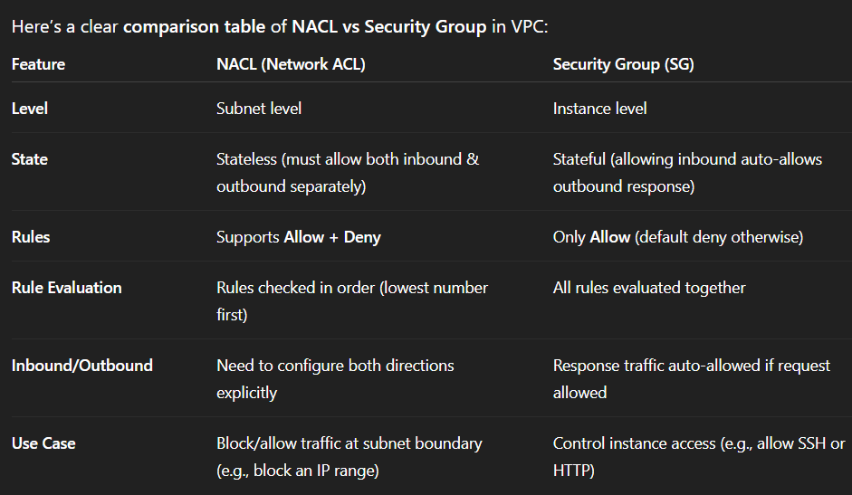
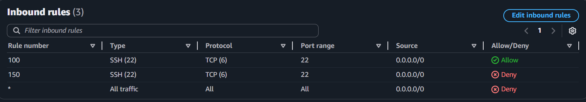
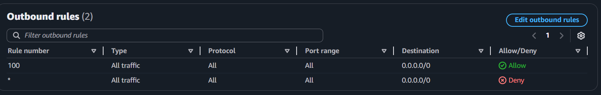
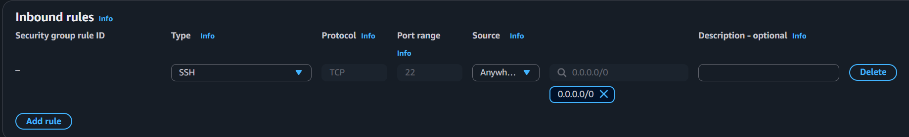
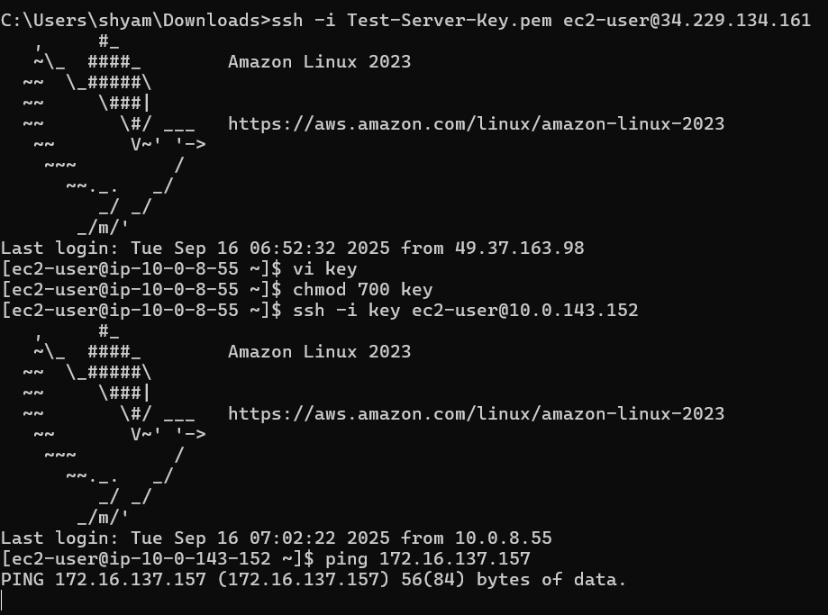
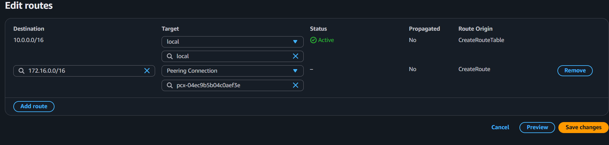
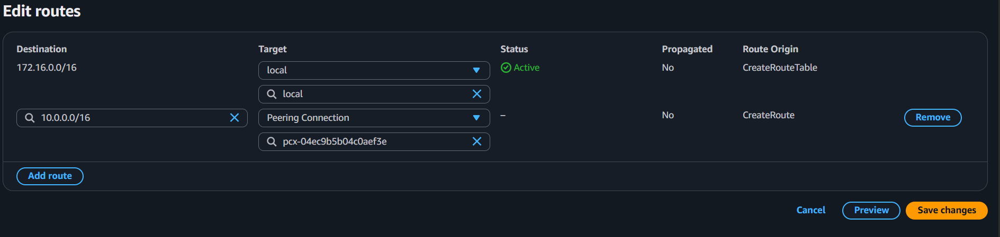
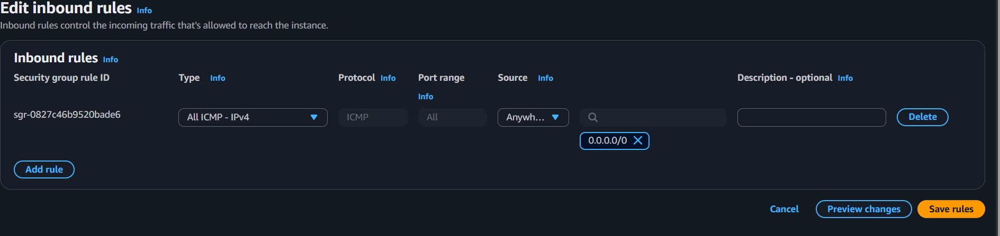
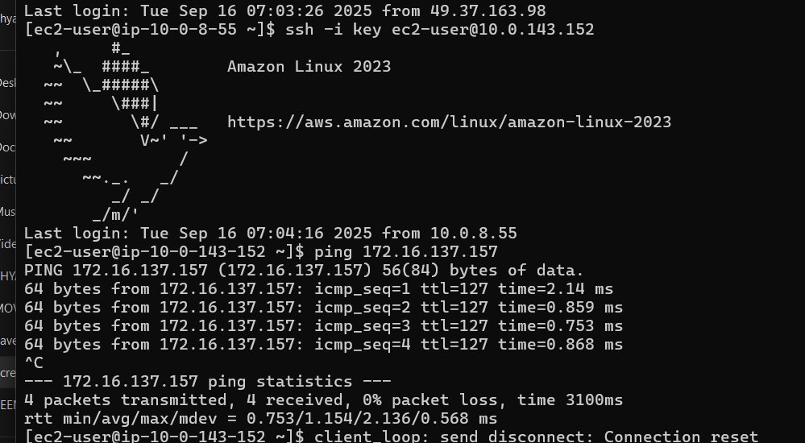

# ☁️ Amazon Web Services (AWS) 

A well-structured guide covering **IAM, Roles, S3, Policies, Encryption, Replication, Lifecycle Rules, and VPC** — simplified for study and quick reference.

---

## 🔐 AWS Identity and Access Management (IAM)

### 👤 IAM Limits
- **Users:** Up to `5000`
- **Groups:** Up to `300`
- **Managed Policies attached per entity:** Up to `10`

---

### 🧾 Types of Policies
1. **AWS Managed** — Managed by AWS  
2. **Customer Managed** — Created and managed by the user  

---

### 🆔 Amazon Resource Name (ARN)

**Example:**
```

arn:aws:iam::aws:policy/AmazonS3FullAccess

````

#### 🔹 Parts of the ARN:
| Part | Meaning |
|------|----------|
| `arn` | Amazon Resource Name |
| `aws` | AWS Partition (Standard Region) |
| `iam` | AWS Service (IAM) |
| `::` | No region (IAM is global) |
| `aws` | Owned by AWS (not your account) |
| `policy/AmazonS3FullAccess` | Specific policy name |

---

## 🧱 IAM Policies Example

### 🎯 Allow & Deny Access to Buckets
```json
{
  "Version": "2012-10-17",
  "Statement": [
    {
      "Sid": "AllowAccessToBuckets",
      "Effect": "Allow",
      "Action": "s3:*",
      "Resource": [
        "arn:aws:s3:::bucket-677",
        "arn:aws:s3:::test-bucket-7988"
      ]
    },
    {
      "Sid": "DenyRestrictedBucket",
      "Effect": "Deny",
      "Action": "s3:*",
      "Resource": [
        "arn:aws:s3:::test-bucket-86786"
      ]
    }
  ]
}
````

---

### 📄 Inline Policy

* Created for a **specific user** (not reusable across groups).

---

### 🧭 Types of IAM Policies

* Identity-based Policy
* Resource-based Policy
* Access Control List (ACL)
* Permission Boundaries
* Session Policy
* Organization Service Control Policy
* Organization Resource Control Policy

---

## 🧰 AWS Roles

### 🎯 Purpose

* Grant **temporary access** using **STS (Security Token Service)**.
* Used for **cross-account access** or **temporary credentials**.

### ⚙️ Steps to Create Role

1. Create a Role & Assign Permissions
2. Create Inline Policy for the User

```json
{
  "Version": "2012-10-17",
  "Statement": [
    {
      "Sid": "Statement1",
      "Effect": "Allow",
      "Action": ["sts:AssumeRole"],
      "Resource": ["arn:aws:iam::526888234336:role/TempUse"]
    }
  ]
}
```

➡️ Then go to AWS Console → **Switch Role** under your profile.

---

## 🔄 Cross-Account Role Access

### 🧩 Goal

Allow your IAM user (Account A) to access your friend’s AWS Account (Account B).

---

### 👥 Friend’s Account (B)

1. Create Role → Choose **Another AWS Account**
2. Enter **Your Account ID**
3. Attach Policies (e.g., `AmazonS3ReadOnlyAccess`)
4. Copy Role ARN:

```
arn:aws:iam::123456789012:role/CrossAccountAccessRole
```

---

### 👤 Your Account (A)

Attach Policy to your IAM User:

```json
{
  "Version": "2012-10-17",
  "Statement": [
    {
      "Effect": "Allow",
      "Action": "sts:AssumeRole",
      "Resource": "arn:aws:iam::123456789012:role/CrossAccountAccessRole"
    }
  ]
}
```

Then go to AWS Console → **Switch Role**

---

## 🖥️ EC2 — Launching Instance

1. Launch EC2 → Configure resources (CPU, memory, key pair)
2. Create IAM Role (e.g., to access S3)
3. Attach Role:
   `Actions → Security → Modify IAM Role`
4. Connect via terminal:

   ```bash
   ssh -i "C:\path\Demo-KeyServer.pem" ec2-user@<PublicIP>
   ```
5. Example command:

   ```bash
   aws s3 ls
   ```
6. Terminate after use → `Instance State → Terminate`

---

## 🧑‍💼 AWS Identity Center (SSO) vs AWS Organizations

| Feature  | AWS Identity Center            | AWS Organizations               |
| -------- | ------------------------------ | ------------------------------- |
| Purpose  | Central user access management | Manage multiple AWS accounts    |
| Function | Single Sign-On (SSO)           | Group accounts & set policies   |
| Control  | IAM Role Assignments           | Service Control Policies (SCPs) |
| Billing  | Per user                       | Consolidated Billing            |

---

## 🪣 Amazon S3 (Simple Storage Service)

### ⚙️ Features

* Unlimited storage
* Auto-scalable
* Highly reliable
* Max upload: **160 GB (Console)**, **5 TB (CLI)**
* Use **Multipart Upload** for >5TB files

---

### 🗂️ Storage Types

* **Block Storage** → EBS
* **File Storage** → EFS
* **Object Storage** → S3

---

### 🧾 Bucket Types

1. General Purpose
2. Directory Bucket (Low latency)
3. Table Bucket (Tabular data)

---

### 💻 CLI Commands

```bash
aws s3 ls                        # List Buckets
aws s3 mb s3://tempbuck0078      # Create Bucket
aws s3 rb s3://tempbuck0078 --force  # Delete Bucket
```

🔗 [More S3 CLI Commands](https://docs.aws.amazon.com/cli/latest/index.html)

---

## 🗃️ S3 Bucket Management

### 🧬 Versioning

* Prevent overwriting objects with the same name.
  **Types:**
* Versioned
* Unversioned
* Version Suspended

---

### 🌐 Access Object via URL

1. Enable ACLs
2. Disable “Block Public Access”
3. Make Object Public

---

## 🛡️ Object Lock

* Implements **WORM (Write Once, Read Many)** model.
* Prevents deletion/modification for a set period.

### 🕒 Retention Modes

* **Compliance Mode** — Even root can’t delete
* **Governance Mode** — Admins can modify with special permissions
* **Legal Hold** — No expiry until removed

---

## 🧩 S3 ACL (Access Control List)

| Type       | Purpose       | Permissions                      |
| ---------- | ------------- | -------------------------------- |
| Bucket ACL | Whole bucket  | READ, WRITE, READ_ACP, WRITE_ACP |
| Object ACL | Single object | READ, READ_ACP, WRITE_ACP        |

---

## 📜 Server Access Logging

* Logs every action in a bucket.
* To avoid recursive logs, store them in a **destination bucket**.

✅ Steps:

1. Create destination bucket
2. Enable logging in **source bucket (Properties tab)**
3. Check `.log` files in destination bucket

---

## 🔒 S3 Encryption

### 🧠 Types

| Type        | Where It Happens  | Key Managed By |
| ----------- | ----------------- | -------------- |
| Client-side | Before upload     | You            |
| SSE-S3      | In S3             | AWS            |
| SSE-KMS     | In S3             | KMS            |
| DSSE-KMS    | Dual KMS keys     | AWS KMS        |
| SSE-C       | Customer-provided | You            |

---

## 📄 Bucket Policy Example

Make all objects public:

```json
{
  "Version": "2012-10-17",
  "Statement": [
    {
      "Sid": "PublicReadGetObject",
      "Effect": "Allow",
      "Principal": "*",
      "Action": "s3:GetObject",
      "Resource": "arn:aws:s3:::my-example-bucket/*"
    }
  ]
}
```

---

## 🔁 Replication

* **CRR (Cross-Region Replication):** Between regions
* **SRR (Same-Region Replication):** Within same region
* **Cross-Account Replication:** Between different accounts

---

## ⚙️ S3 Batch Operations

Perform bulk operations:

* Copy objects
* Modify tags or ACLs
* Trigger Lambda for each object

---

## 🏠 S3 Outposts

* Run S3 locally on AWS Outposts hardware.

---

## 🧮 Storage Classes & Lifecycle

### 🗂️ Frequent Access

* **S3 Standard**
* **S3 Express One Zone**
* **Reduced Redundancy (RRS)**

### 🕓 Infrequent Access

* **Standard-IA**
* **One Zone-IA**

### 📦 Archive

* **Glacier Instant Retrieval**
* **Glacier Flexible Retrieval**
* **Glacier Deep Archive**

### 🤖 Intelligent-Tiering

Automatically moves data between:

* Frequent Access
* Infrequent Access
* Archive Tiers

---

## ⏳ Lifecycle Configuration

**Two actions:**

* **Transition** → Move to cheaper storage
* **Expiration** → Delete after time period

✅ Steps:

1. Open bucket → **Management tab**
2. Create rule → Define transitions & expiration

---

## 🔔 S3 Event Notification

Triggers alerts for:

* Object created
* Object deleted
* Metadata changes

---

## ⚡ S3 Transfer Acceleration

* Uses CloudFront Edge locations for faster uploads/downloads.

---

## 💰 S3 Requester Pays

* Requester pays download & data transfer costs, not bucket owner.

---

## 🌐 VPC (Virtual Private Cloud)

A **private, isolated network** inside AWS.

### 🔹 Key Features:

* Define IP range (CIDR)
* Create public/private subnets
* Manage routing via route tables
* Secure via Security Groups & Network ACLs
* Internet access via **Internet Gateway**

---

## 💻 EC2 via CMD

Connect to EC2 from Windows CMD:

```bash
ssh -i "C:\Users\shyam\Documents\Demo-KeyServer.pem" ec2-user@54.210.154.178
```

> ⚠️ If connection fails, edit **Inbound Rules** of Security Group to allow SSH (port 22).

---

## 🧠 Kernel & CLI Essentials

### ⚙️ What is a Kernel?
> The **kernel** is the core component of an operating system.  
It acts as a **bridge between hardware and software**, managing communication between the two.
> 


---

## 💻 Common CLI Commands

| Command | Description |
|----------|--------------|
| `whoami` | Display current username |
| `echo $0` | Show current shell type |
| `ls` | List files and folders |
| `mkdir <dir>` | Create a new directory |
| `Ctrl + L` | Clear CLI window |
| `cd` | Change directory |
| `pwd` | Show current working directory |
| `cd ..` | Go back to previous directory |
| `touch <file>` | Create an empty file |
| `rmdir <dir>` | Delete a directory |
| `rm *` | Remove all files and directories |
| `mkdir name1 name2` | Create 2 directories instantly |
| `mkdir folder{1..100}` | Create 100 folders instantly |
| `rmdir folder{1..100}` | Delete 100 folders instantly |
| `touch file1 file2` | Create multiple empty files |
| `rm -rf *` | Force delete all files/folders |
| `ls -a` | Show hidden files |
| `ll` | Detailed list of files and permissions |

---

## 📝 Text Editors

### 🧩 Using VI Editor

Two modes in VI:
1. **Command Mode** → Press `Esc`
2. **Insert Mode** → Press `i`

#### Editing and Saving
```bash
i                # Enter insert mode
<Esc>            # Go back to command mode
:wq              # Save and exit
cat filename     # View file content
````

---

### 🧠 Using NANO Editor

```bash
touch demo.txt
nano demo.txt
# Edit the content
Ctrl + O + Enter  # Save
Ctrl + X          # Exit
```

---

## 👤 User Management (Linux)

### 🧱 Create a New User

```bash
sudo su
adduser <username>
```

### 🔑 Set Password

```bash
passwd <username>
```

### 🔄 Switch to Root

```bash
sudo su
```

### 🧭 List All Users

```bash
sudo su
cd /
cd etc/
cat passwd
```

---

### ⚙️ Sudoers Access (Root Privileges)

If new user cannot switch to root:

```bash
usermod -aG wheel <username>
sudo su
```

---

## 🔒 Permissions & Ownership

### View Permissions

Example:

```
drwxr-xr-x. 2 ec2-user ec2-user 6 Aug 26 06:03 test
```

| Symbol | Meaning                   |
| ------ | ------------------------- |
| d      | Directory (if “-” → file) |
| rwx    | Read, Write, Execute      |
| r-x    | Read, Execute (no write)  |

---

### 🔧 Modify Permissions

```bash
chmod 777 test
```

| Number | Meaning | Permissions |
| ------ | ------- | ----------- |
| 7      | 4+2+1   | rwx (full)  |
| 6      | 4+2     | rw-         |
| 5      | 4+1     | r-x         |
| 4      | 4       | r--         |
| 0      | 0       | ---         |

Example:

```
chmod 755 folder
```

---

### 👑 Change Ownership

```bash
sudo chown <user> <directory>
```

---

## 🧱 VPC (Virtual Private Cloud)

> A **VPC** is a private, isolated network inside AWS where you can launch and control resources securely.

---

### 🧩 STEP 1 — CREATE A VPC

**CIDR Block:** Defines a range of IP addresses for your VPC and subnets.
🧮 Use calculator: [Subnet Calculator](https://www.davidc.net/sites/default/subnets/subnets.html)

#### 🧠 Components of VPC

1. **VPC:** Virtual network to host AWS resources.
2. **Subnets:** Segments of your IP range.

   * **Public Subnet** → Connected to Internet Gateway.
   * **Private Subnet** → No direct Internet access.
3. **Internet Gateway (IGW):** Enables internet connectivity.
4. **Route Table:** Controls traffic routing (to IGW or NAT).

---

### 🧩 STEP 2 — CREATE SUBNETS

* Go to **Subnets tab** → Create subnet.
* Select your VPC.
* Assign name and **CIDR Block**.
* When VPC is created → AWS auto-creates:

  * Main Route Table
  * Network ACL
  * DHCP Options Set
  * Default Security Group

#### ⚠️ Reserved IPs in Subnet

| IP Address | Usage             |
| ---------- | ----------------- |
| 10.0.0.0   | Network Address   |
| 10.0.0.1   | VPC Router        |
| 10.0.0.2   | DNS Address       |
| 10.0.0.3   | Future Use        |
| 10.0.0.127 | Broadcast Address |

---

### 🌐 STEP 3 — CREATE INTERNET GATEWAY

1. Go to **Internet Gateways tab** → Create IGW
2. Attach to existing VPC via **Actions → Attach to VPC**

---

### 🛣️ STEP 4 — ROUTE TABLE CONFIGURATION

1. Go to **Route Tables**
2. Select your VPC’s route table
3. Add route:

   ```
   Destination: 0.0.0.0/0
   Target: Your Internet Gateway (IGW)
   ```
4. Use **Resource Map** to visualize connections.

---

### 💻 STEP 5 — ATTACH VPC TO EC2

* While launching EC2 instance:

  * Under **Network Settings**, select your VPC & Subnet.
  * Enable Auto-assign Public IP.
  * Assign appropriate Security Group.
  * Launch instance.

---

### 🖥️ STEP 6 — CLI CONNECTION

```bash
ssh -i "C:\Users\shyam\Downloads\Test-Server-Key.pem" ec2-user@67.202.33.11
# If timeout → modify Security Group inbound rules for SSH (port 22)
```

---

### 🔒 STEP 7 — MAKE SUBNET PRIVATE

* Create **new Route Table**.
* Associate only **private subnet** with this new route table.
* Verify via **Resource Map**.

---

### 🔐 STEP 8 — CONNECT TO PRIVATE SERVER

1. SSH into **Public Server** first.
2. Copy your private key content into a file (using `vi`).
3. Save and set permission:

   ```bash
   chmod 700 <keyfile>
   ssh -i <keyfile> ec2-user@<PrivateIP>
   ```

✅ You’re now connected to the private server via public instance.

> ⚠️ Note: Public server must have internet access (IGW route in Route Table).


---
# ☁️ AWS Networking — NAT, Elastic IP, Firewall, and VPC Peering

> A complete guide to **AWS networking components** including **NAT Gateway**, **Elastic IP**, **NACLs**, **Security Groups**, and **VPC Peering Lifecycle**.  
> Simplified and ready for study or documentation.

---

## 🌐 NAT (Network Address Translation)

In AWS, **NAT** allows instances in a **private subnet** to access the **internet** (for updates, APIs, etc.) without exposing them to inbound internet traffic.

### 💡 Use Case
Private servers can **download updates** via NAT Gateway,  
but **remain inaccessible** from the internet.

---

### ⚙️ Steps to Access Internet from Private Server via NAT

1. Create a **NAT Gateway** from the VPC console  
2. Select your **Public Subnet**  
3. Allocate an **Elastic IP**  
4. Create the **NAT Gateway**  
5. Assign the NAT Gateway to **Private Route Table**  
6. Add a new route:
   - **Destination:** `0.0.0.0/0`
   - **Target:** NAT Gateway

✅ Done! Private instances now have **outbound internet access** without being exposed publicly.

---

## 🌍 Elastic IP (EIP)

An **Elastic IP (EIP)** is a **static, public IPv4 address** that stays permanently allocated to your AWS account.

### 📌 Key Points

- **Static:** Unlike normal public IPs (which change when you stop/start an instance), an EIP **remains the same**.  
- **Re-mappable:** You can detach it from one instance and attach it to another — useful for **failover or recovery**.  
- **Purpose:** Provides a **permanent and consistent** public IP for EC2 instances or other resources.

---

### ⚙️ Steps to Allocate and Manage Elastic IP

1. Go to **VPC → Elastic IPs → Allocate Elastic IP Address**
2. Once allocated → **Actions → Associate Elastic IP**
3. Select the **EC2 instance** and **Save**
4. After use:
   - **Disassociate** the IP  
   - **Release** it from your account  

---

## 🔥 Firewall in VPC

AWS VPC provides **two firewall layers** to control inbound and outbound traffic.

| Firewall Type | Level | Stateful | Description |
|----------------|--------|-----------|--------------|
| **Network ACL (NACL)** | Subnet-level | ❌ Stateless | Controls subnet traffic using numbered rules |
| **Security Group** | Instance-level | ✅ Stateful | Controls inbound/outbound traffic for EC2 |



---

## 🧱 Setting Up NACL (Network Access Control List)

### ⚙️ Steps:

1. Go to **VPC → Network ACLs → Create**
2. Select your **VPC**  
3. Under **Subnet Associations**, add the subnet(s) you want  
4. Add **Inbound** and **Outbound** rules (both mandatory)  
5. Remember:
   - Lower **Rule Number** = Higher priority  
   - `*` (asterisk) = Lowest priority
  
  

6. Outbound traffic should allow **All Traffic** for internet access

> 🚫 Based on the configured rules and ports, the server traffic may be **allowed or denied**.

---

## 🛡️ Setting Up Security Groups

### ⚙️ Steps:

1. Go to **VPC → Security Groups → Create Security Group**
2. Add **Inbound Rules** (Outbound rules are open by default)
   
4. To attach:
   - EC2 → **Actions → Security → Change Security Groups**
   - Remove the existing group  
   - Add your **new custom Security Group**

✅ Security Groups are **stateful**, meaning return traffic is automatically allowed.

---

## 🔢 Port Numbers

| Type | Range | Description |
|-------|--------|-------------|
| **Total** | 0 – 65535 | All available ports |
| **Well-known Ports** | 0 – 1023 | Common services (HTTP, SSH, etc.) |
| **Registered Ports** | 1024 – 49151 | User and system applications |
| **Dynamic Ports** | 49152 – 65535 | Private/temporary connections |

---

## 🔁 VPC Peering Connection Lifecycle

Below are the stages of a **VPC Peering Connection** in AWS.




| State | Description |
|--------|--------------|
| **Initiating-request** | A VPC peering request is created by the requester |
| **Pending-acceptance** | Waiting for the accepter VPC to approve |
| **Active** | Peering successfully established |
| **Provisioning** | Connection setup in progress |
| **Deleting** | Connection is being removed |
| **Deleted** | Peering removed completely |
| **Failed** | Request could not be completed |
| **Expired** | Request not accepted in time |
| **Rejected** | Request denied by the accepter |
| **No longer visible** | Removed from console after failure/rejection |

---

## 🌉 VPC Peering Connection

**Definition:**  
A **VPC Peering Connection** enables **two VPCs** to communicate using **private IP addresses**, making them appear as if they’re on the same internal network.

---

### ⚙️ STEP 1 — Create Two VPCs

1. **VPC A:** Public + Private Subnets  
2. **VPC B:** Private Subnet only  
3. AWS automatically creates:
   - Route Tables  
   - Internet Gateway  
   - Public & Private Subnets  

Example setup:
- **VPC A:** (Public + Private Subnets)  
- **VPC B:** (Private Subnet only)

---

### ⚙️ STEP 2 — Create EC2 Instances

1. Launch **3 EC2 Instances**
   - Instance 1 → VPC A (Public Subnet)
   - Instance 2 → VPC A (Private Subnet)
   - Instance 3 → VPC B (Private Subnet)
     

2. At this stage, **VPC A** and **VPC B** cannot communicate (no peering yet).

---

### ⚙️ STEP 3 — Create the Peering Connection

1. Go to **VPC → Peering Connections → Create**
2. **Requester:** VPC A (Public + Private)  
   **Accepter:** VPC B (Private only)
3. Once created → Select Peering → **Actions → Accept Request**

---

### ⚙️ STEP 4 — Update Route Tables

- **Private Route Table (VPC A):**
  - Destination: CIDR range of VPC B
  - Target: Peering Connection
    


- **Private Route Table (VPC B):**
  - Destination: CIDR range of VPC A
  - Target: Peering Connection  
  

---

### ⚙️ STEP 5 — Configure Security Groups

- Go to **EC2 → Security → Edit Inbound Rules**
- Add **ICMP (Ping)** rule to allow communication between private instances  
  (used for testing connectivity)


---

### ⚙️ STEP 6 — Verify Connection

From the **Private Instance in VPC A**, test connection to **Private Instance in VPC B:**



```bash
ping <Private-IP-of-VPC-B-instance>
````

✅ If ping succeeds, VPC Peering is active and functional.

---

## 🧠 Notes

* VPC Peering **across regions** requires **different key pairs**
* When peering **between AWS accounts**, copy the **VPC ID** of the peer account
* Both accounts must have at least **one public and one private subnet**
* Number of possible Peering Connections:

  ```
  n(n - 1) / 2
  ```

---

## 🔁 Connection Flow Diagram (Text Representation)

```
JUMP SERVER (Public)
   ↓
PRIVATE SERVER (Same VPC)
   ↓
VPC PEERING CONNECTION
   ↓
PRIVATE SERVER (Another VPC)
```

---

## 🧩 Summary Table

| Component            | Purpose                                              |
| -------------------- | ---------------------------------------------------- |
| **NAT Gateway**      | Allows private instances to access internet securely |
| **Elastic IP (EIP)** | Static, public IPv4 address for instances            |
| **NACL**             | Subnet-level firewall (stateless)                    |
| **Security Group**   | Instance-level firewall (stateful)                   |
| **VPC Peering**      | Connects VPCs privately using internal IPs           |

---


