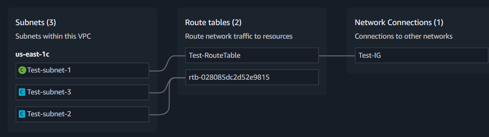

# ☁️ Amazon Web Services (AWS)


A well-structured guide covering **IAM, Roles, S3, Policies, Encryption, Replication, Lifecycle Rules, and VPC** — simplified for study and quick reference.

---

## 🔐 AWS Identity and Access Management (IAM)

### 👤 IAM Limits
- **Users:** Up to `5000`
- **Groups:** Up to `300`
- **Managed Policies attached per entity:** Up to `10`

---

### 🧾 Types of Policies
1. **AWS Managed** — Managed by AWS  
2. **Customer Managed** — Created and managed by the user  

---

### 🆔 Amazon Resource Name (ARN)

**Example:**
```

arn:aws:iam::aws:policy/AmazonS3FullAccess

````

#### 🔹 Parts of the ARN:
| Part | Meaning |
|------|----------|
| `arn` | Amazon Resource Name |
| `aws` | AWS Partition (Standard Region) |
| `iam` | AWS Service (IAM) |
| `::` | No region (IAM is global) |
| `aws` | Owned by AWS (not your account) |
| `policy/AmazonS3FullAccess` | Specific policy name |

---

## 🧱 IAM Policies Example

### 🎯 Allow & Deny Access to Buckets
```json
{
  "Version": "2012-10-17",
  "Statement": [
    {
      "Sid": "AllowAccessToBuckets",
      "Effect": "Allow",
      "Action": "s3:*",
      "Resource": [
        "arn:aws:s3:::bucket-677",
        "arn:aws:s3:::test-bucket-7988"
      ]
    },
    {
      "Sid": "DenyRestrictedBucket",
      "Effect": "Deny",
      "Action": "s3:*",
      "Resource": [
        "arn:aws:s3:::test-bucket-86786"
      ]
    }
  ]
}
````

---

### 📄 Inline Policy

* Created for a **specific user** (not reusable across groups).

---

### 🧭 Types of IAM Policies

* Identity-based Policy
* Resource-based Policy
* Access Control List (ACL)
* Permission Boundaries
* Session Policy
* Organization Service Control Policy
* Organization Resource Control Policy

---

## 🧰 AWS Roles

### 🎯 Purpose

* Grant **temporary access** using **STS (Security Token Service)**.
* Used for **cross-account access** or **temporary credentials**.

### ⚙️ Steps to Create Role

1. Create a Role & Assign Permissions
2. Create Inline Policy for the User

```json
{
  "Version": "2012-10-17",
  "Statement": [
    {
      "Sid": "Statement1",
      "Effect": "Allow",
      "Action": ["sts:AssumeRole"],
      "Resource": ["arn:aws:iam::526888234336:role/TempUse"]
    }
  ]
}
```

➡️ Then go to AWS Console → **Switch Role** under your profile.

---

## 🔄 Cross-Account Role Access

### 🧩 Goal

Allow your IAM user (Account A) to access your friend’s AWS Account (Account B).

---

### 👥 Friend’s Account (B)

1. Create Role → Choose **Another AWS Account**
2. Enter **Your Account ID**
3. Attach Policies (e.g., `AmazonS3ReadOnlyAccess`)
4. Copy Role ARN:

```
arn:aws:iam::123456789012:role/CrossAccountAccessRole
```

---

### 👤 Your Account (A)

Attach Policy to your IAM User:

```json
{
  "Version": "2012-10-17",
  "Statement": [
    {
      "Effect": "Allow",
      "Action": "sts:AssumeRole",
      "Resource": "arn:aws:iam::123456789012:role/CrossAccountAccessRole"
    }
  ]
}
```

Then go to AWS Console → **Switch Role**

---

## 🖥️ EC2 — Launching Instance

1. Launch EC2 → Configure resources (CPU, memory, key pair)
2. Create IAM Role (e.g., to access S3)
3. Attach Role:
   `Actions → Security → Modify IAM Role`
4. Connect via terminal:

   ```bash
   ssh -i "C:\path\Demo-KeyServer.pem" ec2-user@<PublicIP>
   ```
5. Example command:

   ```bash
   aws s3 ls
   ```
6. Terminate after use → `Instance State → Terminate`

---

## 🧑‍💼 AWS Identity Center (SSO) vs AWS Organizations

| Feature  | AWS Identity Center            | AWS Organizations               |
| -------- | ------------------------------ | ------------------------------- |
| Purpose  | Central user access management | Manage multiple AWS accounts    |
| Function | Single Sign-On (SSO)           | Group accounts & set policies   |
| Control  | IAM Role Assignments           | Service Control Policies (SCPs) |
| Billing  | Per user                       | Consolidated Billing            |

---

## 🪣 Amazon S3 (Simple Storage Service)


### ⚙️ Features

* Unlimited storage
* Auto-scalable
* Highly reliable
* Max upload: **160 GB (Console)**, **5 TB (CLI)**
* Use **Multipart Upload** for >5TB files

---

### 🗂️ Storage Types

* **Block Storage** → EBS
* **File Storage** → EFS
* **Object Storage** → S3

---

### 🧾 Bucket Types

1. General Purpose
2. Directory Bucket (Low latency)
3. Table Bucket (Tabular data)

---

### 💻 CLI Commands

```bash
aws s3 ls                        # List Buckets
aws s3 mb s3://tempbuck0078      # Create Bucket
aws s3 rb s3://tempbuck0078 --force  # Delete Bucket
```

🔗 [More S3 CLI Commands](https://docs.aws.amazon.com/cli/latest/index.html)

---

## 🗃️ S3 Bucket Management

### 🧬 Versioning

* Prevent overwriting objects with the same name.
  **Types:**
* Versioned
* Unversioned
* Version Suspended

---

### 🌐 Access Object via URL

1. Enable ACLs
2. Disable “Block Public Access”
3. Make Object Public

---

## 🛡️ Object Lock

* Implements **WORM (Write Once, Read Many)** model.
* Prevents deletion/modification for a set period.

### 🕒 Retention Modes

* **Compliance Mode** — Even root can’t delete
* **Governance Mode** — Admins can modify with special permissions
* **Legal Hold** — No expiry until removed

---

## 🧩 S3 ACL (Access Control List)

| Type       | Purpose       | Permissions                      |
| ---------- | ------------- | -------------------------------- |
| Bucket ACL | Whole bucket  | READ, WRITE, READ_ACP, WRITE_ACP |
| Object ACL | Single object | READ, READ_ACP, WRITE_ACP        |

---

## 📜 Server Access Logging

* Logs every action in a bucket.
* To avoid recursive logs, store them in a **destination bucket**.

✅ Steps:

1. Create destination bucket
2. Enable logging in **source bucket (Properties tab)**
3. Check `.log` files in destination bucket

---

## 🔒 S3 Encryption

### 🧠 Types

| Type        | Where It Happens  | Key Managed By |
| ----------- | ----------------- | -------------- |
| Client-side | Before upload     | You            |
| SSE-S3      | In S3             | AWS            |
| SSE-KMS     | In S3             | KMS            |
| DSSE-KMS    | Dual KMS keys     | AWS KMS        |
| SSE-C       | Customer-provided | You            |

---

## 📄 Bucket Policy Example

Make all objects public:

```json
{
  "Version": "2012-10-17",
  "Statement": [
    {
      "Sid": "PublicReadGetObject",
      "Effect": "Allow",
      "Principal": "*",
      "Action": "s3:GetObject",
      "Resource": "arn:aws:s3:::my-example-bucket/*"
    }
  ]
}
```

---

## 🔁 Replication

* **CRR (Cross-Region Replication):** Between regions
* **SRR (Same-Region Replication):** Within same region
* **Cross-Account Replication:** Between different accounts

---

## ⚙️ S3 Batch Operations

Perform bulk operations:

* Copy objects
* Modify tags or ACLs
* Trigger Lambda for each object

---

## 🏠 S3 Outposts

* Run S3 locally on AWS Outposts hardware.

---

## 🧮 Storage Classes & Lifecycle

### 🗂️ Frequent Access

* **S3 Standard**
* **S3 Express One Zone**
* **Reduced Redundancy (RRS)**

### 🕓 Infrequent Access

* **Standard-IA**
* **One Zone-IA**

### 📦 Archive

* **Glacier Instant Retrieval**
* **Glacier Flexible Retrieval**
* **Glacier Deep Archive**

### 🤖 Intelligent-Tiering

Automatically moves data between:

* Frequent Access
* Infrequent Access
* Archive Tiers

---

## ⏳ Lifecycle Configuration

**Two actions:**

* **Transition** → Move to cheaper storage
* **Expiration** → Delete after time period

✅ Steps:

1. Open bucket → **Management tab**
2. Create rule → Define transitions & expiration

---

## 🔔 S3 Event Notification

Triggers alerts for:

* Object created
* Object deleted
* Metadata changes

---

## ⚡ S3 Transfer Acceleration

* Uses CloudFront Edge locations for faster uploads/downloads.

---

## 💰 S3 Requester Pays

* Requester pays download & data transfer costs, not bucket owner.

---

## 🌐 VPC (Virtual Private Cloud)


A **private, isolated network** inside AWS.

### 🔹 Key Features:

* Define IP range (CIDR)
* Create public/private subnets
* Manage routing via route tables
* Secure via Security Groups & Network ACLs
* Internet access via **Internet Gateway**

---

## 💻 EC2 via CMD

Connect to EC2 from Windows CMD:

```bash
ssh -i "C:\Users\shyam\Documents\Demo-KeyServer.pem" ec2-user@54.210.154.178
```

> ⚠️ If connection fails, edit **Inbound Rules** of Security Group to allow SSH (port 22).

---

## 🧠 Kernel & CLI Essentials

### ⚙️ What is a Kernel?
> The **kernel** is the core component of an operating system.  
It acts as a **bridge between hardware and software**, managing communication between the two.
> 


---

## 💻 Common CLI Commands

| Command | Description |
|----------|--------------|
| `whoami` | Display current username |
| `echo $0` | Show current shell type |
| `ls` | List files and folders |
| `mkdir <dir>` | Create a new directory |
| `Ctrl + L` | Clear CLI window |
| `cd` | Change directory |
| `pwd` | Show current working directory |
| `cd ..` | Go back to previous directory |
| `touch <file>` | Create an empty file |
| `rmdir <dir>` | Delete a directory |
| `rm *` | Remove all files and directories |
| `mkdir name1 name2` | Create 2 directories instantly |
| `mkdir folder{1..100}` | Create 100 folders instantly |
| `rmdir folder{1..100}` | Delete 100 folders instantly |
| `touch file1 file2` | Create multiple empty files |
| `rm -rf *` | Force delete all files/folders |
| `ls -a` | Show hidden files |
| `ll` | Detailed list of files and permissions |

---

## 📝 Text Editors

### 🧩 Using VI Editor

Two modes in VI:
1. **Command Mode** → Press `Esc`
2. **Insert Mode** → Press `i`

#### Editing and Saving
```bash
i                # Enter insert mode
<Esc>            # Go back to command mode
:wq              # Save and exit
cat filename     # View file content
````

---

### 🧠 Using NANO Editor

```bash
touch demo.txt
nano demo.txt
# Edit the content
Ctrl + O + Enter  # Save
Ctrl + X          # Exit
```

---

## 👤 User Management (Linux)

### 🧱 Create a New User

```bash
sudo su
adduser <username>
```

### 🔑 Set Password

```bash
passwd <username>
```

### 🔄 Switch to Root

```bash
sudo su
```

### 🧭 List All Users

```bash
sudo su
cd /
cd etc/
cat passwd
```

---

### ⚙️ Sudoers Access (Root Privileges)

If new user cannot switch to root:

```bash
usermod -aG wheel <username>
sudo su
```

---

## 🔒 Permissions & Ownership

### View Permissions

Example:

```
drwxr-xr-x. 2 ec2-user ec2-user 6 Aug 26 06:03 test
```

| Symbol | Meaning                   |
| ------ | ------------------------- |
| d      | Directory (if “-” → file) |
| rwx    | Read, Write, Execute      |
| r-x    | Read, Execute (no write)  |

---

### 🔧 Modify Permissions

```bash
chmod 777 test
```

| Number | Meaning | Permissions |
| ------ | ------- | ----------- |
| 7      | 4+2+1   | rwx (full)  |
| 6      | 4+2     | rw-         |
| 5      | 4+1     | r-x         |
| 4      | 4       | r--         |
| 0      | 0       | ---         |

Example:

```
chmod 755 folder
```

---

### 👑 Change Ownership

```bash
sudo chown <user> <directory>
```

---

## 🧱 VPC (Virtual Private Cloud)

> A **VPC** is a private, isolated network inside AWS where you can launch and control resources securely.

---

### 🧩 STEP 1 — CREATE A VPC

**CIDR Block:** Defines a range of IP addresses for your VPC and subnets.
🧮 Use calculator: [Subnet Calculator](https://www.davidc.net/sites/default/subnets/subnets.html)

#### 🧠 Components of VPC

1. **VPC:** Virtual network to host AWS resources.
2. **Subnets:** Segments of your IP range.

   * **Public Subnet** → Connected to Internet Gateway.
   * **Private Subnet** → No direct Internet access.
3. **Internet Gateway (IGW):** Enables internet connectivity.
4. **Route Table:** Controls traffic routing (to IGW or NAT).

---

### 🧩 STEP 2 — CREATE SUBNETS

* Go to **Subnets tab** → Create subnet.
* Select your VPC.
* Assign name and **CIDR Block**.
* When VPC is created → AWS auto-creates:

  * Main Route Table
  * Network ACL
  * DHCP Options Set
  * Default Security Group

#### ⚠️ Reserved IPs in Subnet

| IP Address | Usage             |
| ---------- | ----------------- |
| 10.0.0.0   | Network Address   |
| 10.0.0.1   | VPC Router        |
| 10.0.0.2   | DNS Address       |
| 10.0.0.3   | Future Use        |
| 10.0.0.127 | Broadcast Address |

---

### 🌐 STEP 3 — CREATE INTERNET GATEWAY

1. Go to **Internet Gateways tab** → Create IGW
2. Attach to existing VPC via **Actions → Attach to VPC**

---

### 🛣️ STEP 4 — ROUTE TABLE CONFIGURATION

1. Go to **Route Tables**
2. Select your VPC’s route table
3. Add route:

   ```
   Destination: 0.0.0.0/0
   Target: Your Internet Gateway (IGW)
   ```
4. Use **Resource Map** to visualize connections.

---

### 💻 STEP 5 — ATTACH VPC TO EC2

* While launching EC2 instance:

  * Under **Network Settings**, select your VPC & Subnet.
  * Enable Auto-assign Public IP.
  * Assign appropriate Security Group.
  * Launch instance.

---

### 🖥️ STEP 6 — CLI CONNECTION

```bash
ssh -i "C:\Users\shyam\Downloads\Test-Server-Key.pem" ec2-user@67.202.33.11
# If timeout → modify Security Group inbound rules for SSH (port 22)
```

---

### 🔒 STEP 7 — MAKE SUBNET PRIVATE

* Create **new Route Table**.
* Associate only **private subnet** with this new route table.
* Verify via **Resource Map**.

---

### 🔐 STEP 8 — CONNECT TO PRIVATE SERVER

1. SSH into **Public Server** first.
2. Copy your private key content into a file (using `vi`).
3. Save and set permission:

   ```bash
   chmod 700 <keyfile>
   ssh -i <keyfile> ec2-user@<PrivateIP>
   ```

✅ You’re now connected to the private server via public instance.

> ⚠️ Note: Public server must have internet access (IGW route in Route Table).


---
# ☁️ AWS Networking — NAT, Elastic IP, Firewall, and VPC Peering

> A complete guide to **AWS networking components** including **NAT Gateway**, **Elastic IP**, **NACLs**, **Security Groups**, and **VPC Peering Lifecycle**.  
> Simplified and ready for study or documentation.

---

## 🌐 NAT (Network Address Translation)

In AWS, **NAT** allows instances in a **private subnet** to access the **internet** (for updates, APIs, etc.) without exposing them to inbound internet traffic.

### 💡 Use Case
Private servers can **download updates** via NAT Gateway,  
but **remain inaccessible** from the internet.

---

### ⚙️ Steps to Access Internet from Private Server via NAT

1. Create a **NAT Gateway** from the VPC console  
2. Select your **Public Subnet**  
3. Allocate an **Elastic IP**  
4. Create the **NAT Gateway**  
5. Assign the NAT Gateway to **Private Route Table**  
6. Add a new route:
   - **Destination:** `0.0.0.0/0`
   - **Target:** NAT Gateway

✅ Done! Private instances now have **outbound internet access** without being exposed publicly.

---

## 🌍 Elastic IP (EIP)

An **Elastic IP (EIP)** is a **static, public IPv4 address** that stays permanently allocated to your AWS account.

### 📌 Key Points

- **Static:** Unlike normal public IPs (which change when you stop/start an instance), an EIP **remains the same**.  
- **Re-mappable:** You can detach it from one instance and attach it to another — useful for **failover or recovery**.  
- **Purpose:** Provides a **permanent and consistent** public IP for EC2 instances or other resources.

---

### ⚙️ Steps to Allocate and Manage Elastic IP

1. Go to **VPC → Elastic IPs → Allocate Elastic IP Address**
2. Once allocated → **Actions → Associate Elastic IP**
3. Select the **EC2 instance** and **Save**
4. After use:
   - **Disassociate** the IP  
   - **Release** it from your account  

---

## 🔥 Firewall in VPC

AWS VPC provides **two firewall layers** to control inbound and outbound traffic.

| Firewall Type | Level | Stateful | Description |
|----------------|--------|-----------|--------------|
| **Network ACL (NACL)** | Subnet-level | ❌ Stateless | Controls subnet traffic using numbered rules |
| **Security Group** | Instance-level | ✅ Stateful | Controls inbound/outbound traffic for EC2 |


---

## 🧱 Setting Up NACL (Network Access Control List)

### ⚙️ Steps:

1. Go to **VPC → Network ACLs → Create**
2. Select your **VPC**  
3. Under **Subnet Associations**, add the subnet(s) you want  
4. Add **Inbound** and **Outbound** rules (both mandatory)  
5. Remember:
   - Lower **Rule Number** = Higher priority  
   - `*` (asterisk) = Lowest priority
 
 

6. Outbound traffic should allow **All Traffic** for internet access

> 🚫 Based on the configured rules and ports, the server traffic may be **allowed or denied**.

---

## 🛡️ Setting Up Security Groups

### ⚙️ Steps:

1. Go to **VPC → Security Groups → Create Security Group**
2. Add **Inbound Rules** (Outbound rules are open by default)
  
4. To attach:
   - EC2 → **Actions → Security → Change Security Groups**
   - Remove the existing group  
   - Add your **new custom Security Group**

✅ Security Groups are **stateful**, meaning return traffic is automatically allowed.

---

## 🔢 Port Numbers

| Type | Range | Description |
|-------|--------|-------------|
| **Total** | 0 – 65535 | All available ports |
| **Well-known Ports** | 0 – 1023 | Common services (HTTP, SSH, etc.) |
| **Registered Ports** | 1024 – 49151 | User and system applications |
| **Dynamic Ports** | 49152 – 65535 | Private/temporary connections |

---

## 🔁 VPC Peering Connection Lifecycle

Below are the stages of a **VPC Peering Connection** in AWS.


| State | Description |
|--------|--------------|
| **Initiating-request** | A VPC peering request is created by the requester |
| **Pending-acceptance** | Waiting for the accepter VPC to approve |
| **Active** | Peering successfully established |
| **Provisioning** | Connection setup in progress |
| **Deleting** | Connection is being removed |
| **Deleted** | Peering removed completely |
| **Failed** | Request could not be completed |
| **Expired** | Request not accepted in time |
| **Rejected** | Request denied by the accepter |
| **No longer visible** | Removed from console after failure/rejection |

---

## 🌉 VPC Peering Connection

**Definition:**  
A **VPC Peering Connection** enables **two VPCs** to communicate using **private IP addresses**, making them appear as if they’re on the same internal network.

---

### ⚙️ STEP 1 — Create Two VPCs

1. **VPC A:** Public + Private Subnets  
2. **VPC B:** Private Subnet only  
3. AWS automatically creates:
   - Route Tables  
   - Internet Gateway  
   - Public & Private Subnets  

Example setup:
- **VPC A:** (Public + Private Subnets)  
- **VPC B:** (Private Subnet only)

---

### ⚙️ STEP 2 — Create EC2 Instances

1. Launch **3 EC2 Instances**
   - Instance 1 → VPC A (Public Subnet)
   - Instance 2 → VPC A (Private Subnet)
   - Instance 3 → VPC B (Private Subnet)
     

2. At this stage, **VPC A** and **VPC B** cannot communicate (no peering yet).

---

### ⚙️ STEP 3 — Create the Peering Connection

1. Go to **VPC → Peering Connections → Create**
2. **Requester:** VPC A (Public + Private)  
   **Accepter:** VPC B (Private only)
3. Once created → Select Peering → **Actions → Accept Request**

---

### ⚙️ STEP 4 — Update Route Tables

- **Private Route Table (VPC A):**
  - Destination: CIDR range of VPC B
  - Target: Peering Connection
    


- **Private Route Table (VPC B):**
  - Destination: CIDR range of VPC A
  - Target: Peering Connection  
 

---

### ⚙️ STEP 5 — Configure Security Groups

- Go to **EC2 → Security → Edit Inbound Rules**
- Add **ICMP (Ping)** rule to allow communication between private instances  
  (used for testing connectivity)


---

### ⚙️ STEP 6 — Verify Connection

From the **Private Instance in VPC A**, test connection to **Private Instance in VPC B:**


```bash
ping <Private-IP-of-VPC-B-instance>
````

✅ If ping succeeds, VPC Peering is active and functional.

---

## 🧠 Notes

* VPC Peering **across regions** requires **different key pairs**
* When peering **between AWS accounts**, copy the **VPC ID** of the peer account
* Both accounts must have at least **one public and one private subnet**
* Number of possible Peering Connections:

  ```
  n(n - 1) / 2
  ```

---

## 🔁 Connection Flow Diagram (Text Representation)

```
JUMP SERVER (Public)
   ↓
PRIVATE SERVER (Same VPC)
   ↓
VPC PEERING CONNECTION
   ↓
PRIVATE SERVER (Another VPC)
```

---

## 🧩 Summary Table

| Component            | Purpose                                              |
| -------------------- | ---------------------------------------------------- |
| **NAT Gateway**      | Allows private instances to access internet securely |
| **Elastic IP (EIP)** | Static, public IPv4 address for instances            |
| **NACL**             | Subnet-level firewall (stateless)                    |
| **Security Group**   | Instance-level firewall (stateful)                   |
| **VPC Peering**      | Connects VPCs privately using internal IPs           |

---
# 🚏 AWS Transit Gateway (TGW) — Complete Guide

> Learn how to use **AWS Transit Gateway (TGW)** to connect multiple VPCs, on-premises networks, and regions seamlessly — all from a **central hub**.

---

## 🌐 What is a Transit Gateway?


**Definition:**  
A **Transit Gateway (TGW)** is a **central hub** that connects multiple **VPCs**, **on-premises networks (via VPN or Direct Connect)**, and even **other AWS accounts**.  
It simplifies complex network architectures by acting as a single routing hub.

> ⚠️ Transit Gateway works **only within the same AWS Region**, but supports **inter-region peering**.

---

## 🕸️ Model: Hub-and-Spoke Architecture

- **Transit Gateway = Hub**  
- **VPCs / On-premises networks = Spokes**

Instead of connecting every VPC to every other VPC (full mesh), each connects only to the **TGW** — greatly reducing complexity.

---

## 🎯 Purpose of Transit Gateway

- Replaces complex **VPC peering meshes**
- Simplifies connectivity between multiple VPCs or accounts
- Enables centralized **routing, monitoring, and security**

---

## ⚙️ Key Features

✅ Centralized routing and traffic control  
✅ Connects **thousands of VPCs**  
✅ Simplifies management vs. multiple VPC peerings  
✅ Highly scalable for large cloud networks  
✅ Supports **inter-region peering** between TGWs  

---

## 🌟 Benefits

- **Simplified network design**  
- **Reduced complexity** (no need for many peerings)  
- **Centralized monitoring & control**  
- **Improved scalability and maintainability**

---

## 🔌 AWS Direct Connect

> **AWS Direct Connect** is a **dedicated private network connection** between your **on-premises data center** and **AWS**.

### 🔹 Features:
- Lower latency & higher bandwidth than internet-based VPN  
- Consistent and secure performance  
- Connects on-premises routers directly to AWS TGW or VPC  

---

# 🧭 Tutorial: AWS Transit Gateway (Same Region Setup)

---

## 🧩 Step 1: Create Two VPCs

- **VPC-A:** Contains both **Public** and **Private** subnets  
- **VPC-B:** Contains only **Private** subnet  

> Each VPC will have its own route table and subnets.

---

## 🖥️ Step 2: Launch EC2 Instances

- **Launch 3 instances total:**
  - 1 instance in **Public subnet (VPC-A)**
  - 2 instances in **Private subnets** (one in each VPC)

---

## 🌉 Step 3: Create Transit Gateway

1. Go to **VPC → Transit Gateways → Create Transit Gateway**  
2. Add a **Name**  
3. State will initially appear as **Pending**

---

## 🔗 Step 4: Create TGW Attachments

1. Go to **VPC → Transit Gateway Attachments**  
2. Choose your **TGW ID**  
3. Select **Attachment Type: VPC**  
4. Create **2 attachments** — one for each VPC (A and B)

---

## 🛣️ Step 5: Edit Route Tables

- **VPC-A (Private Route Table):**
  - Add route → **Destination:** VPC-B CIDR  
  - **Target:** Transit Gateway
    


- **VPC-B (Private Route Table):**
  - Add route → **Destination:** VPC-A CIDR  
  - **Target:** Transit Gateway

  

---

## 🛡️ Step 6: Edit Security Groups

- Modify **Security Group** of the **destination (private)** instance  
- Add rule:
```

Type: ICMP
Protocol: Echo Request
Source: Other VPC CIDR Range

````

---

## 🧪 Step 7: Verify Connectivity

From **VPC-A’s private instance**, test connection to **VPC-B**:
```bash
ping <Private-IP-of-VPC-B-instance>
````

✅ Successful ping → Transit Gateway connection is working!

---

# 🌍 Cross-Region Transit Gateway Peering Exercise

> Let’s connect **two VPCs in different AWS regions** using **Transit Gateways** and **TGW Peering**.

---

## 🌏 Step 1: Create Two VPCs

* **VPC-A (North Virginia):** Contains **Public + Private** subnets → (Requester)
* **VPC-B (Mumbai):** Contains **Private** subnet only → (Accepter)

---

## 🖥️ Step 2: Launch EC2 Instances

* Launch instances:

  * **2 instances in North Virginia**
  * **1 instance in Mumbai**

---

## 🚏 Step 3: Create Transit Gateways and Attachments

1. Create **Transit Gateway** in each region
2. Create attachments:

   * **VPC-A TGW:** 2 attachments (for both subnets)
   * **VPC-B TGW:** 1 attachment
3. For cross-region communication:

   * Create a **Peering Attachment** between both TGWs
   * Accept request from the **receiving region** (Mumbai)

> 🧠 Use “Peering Connection” as the **attachment type** during TGW setup.


---

## 🛣️ Step 4: Transit Gateway Route Tables

* **Virginia TGW Route Table:**

  * Add route → **Destination:** Mumbai VPC CIDR
  * **Target:** Peering Attachment

* **Mumbai TGW Route Table:**

  * Add route → **Destination:** Virginia VPC CIDR
  * **Target:** Peering Attachment

---

## 🧾 Step 5: VPC Route Tables

* **Virginia Private Subnet Route Table:**

  * Destination → Mumbai CIDR
  * Target → Virginia TGW Attachment

* **Mumbai Private Subnet Route Table:**

  * Destination → Virginia CIDR
  * Target → Mumbai TGW Attachment

---

## 🔐 Step 6: Security Groups

* **Mumbai Private EC2 Security Group:**

  * Allow **ICMP (ping)** from Virginia VPC CIDR

* **Virginia Private EC2 Security Group:**

  * Allow outbound (default `0.0.0.0/0` covers ICMP reply)

---

## 🧩 Step 7: Verify Connection

SSH into your **Virginia jump server**, then your **private instance**, and run:

```bash
ping <Mumbai-private-server-IP>
```

✅ If ping succeeds, your **cross-region TGW peering** works correctly!

---

## 💻 To SSH into Mumbai Server (via Virginia)

1. From **Virginia Private Server**, create a file using `vi`
2. Paste the **Mumbai key content** into it
3. Set permission:

   ```bash
   chmod 700 <keyfile>
   ```
4. Connect:

   ```bash
   ssh -i <keyfile> ec2-user@<Mumbai-Private-IP>
   ```

---

# 🧠 Key Takeaways

| Concept                   | Description                                  |
| ------------------------- | -------------------------------------------- |
| **Transit Gateway (TGW)** | Central hub for VPC and on-prem connectivity |
| **TGW Attachment**        | Connects a VPC or network to the TGW         |
| **TGW Peering**           | Connects TGWs across regions                 |
| **AWS Direct Connect**    | Dedicated on-premises to AWS link            |
| **Security Group (SG)**   | Instance-level firewall                      |
| **ICMP (Ping)**           | Used to verify private connectivity          |

---

> 🚀 **Pro Tip:**
> Transit Gateway is like AWS’s **network backbone** — build once, and it scales to thousands of VPCs effortlessly.

# 🧩 AWS VPC Endpoints, Flow Logs, DNS Firewall & Managed Prefix Lists

> A complete guide covering **VPC Endpoints**, **VPC Flow Logs**, **DNS Firewall**, and **AWS Managed Prefix Lists** — simplified for learning and documentation.

---

## 🌐 VPC Endpoints

### 🧠 Definition

A **VPC Endpoint** enables a **private connection** between your VPC and **supported AWS services** (like S3, DynamoDB, etc.) — without needing:

- Internet Gateway (IGW)
- NAT Gateway
- VPN
- AWS Direct Connect

> ✅ All traffic stays **within the AWS network**, ensuring higher security and lower cost.

---

### 🌟 Benefits

| Feature | Description |
|----------|--------------|
| **Security** | No exposure to the public internet |
| **Cost** | Avoid NAT/IGW data transfer charges |
| **Performance** | Lower latency & higher reliability |

---

### 🔁 Example Traffic Flow

| Without Endpoint | With Endpoint |
|-------------------|----------------|
| EC2 → Internet Gateway/NAT → Internet → S3 | EC2 → VPC Endpoint → S3 (Private AWS Network) |

---

## 🔸 Types of VPC Endpoints

### 1️⃣ Interface Endpoint
- Powered by **AWS PrivateLink**
- Creates an **ENI (Elastic Network Interface)** with a private IP inside your subnet
- Used for most AWS services (e.g., **CloudWatch**, **KMS**, **Secrets Manager**)

---

### 2️⃣ Gateway Endpoint
- Adds an entry in **Route Tables**
- Used only for **Amazon S3** and **DynamoDB**

---

### 3️⃣ Gateway Load Balancer Endpoint (GWLBe)
- Connects VPC traffic to **third-party network appliances** (e.g., firewalls, IDS/IPS)
- Ideal for **security and traffic inspection**

---

### 4️⃣ Resource Endpoint
- Exposes a **specific resource** privately to another VPC
- Example: Share one **RDS Database** or **EC2 instance** across VPCs securely

---

### 5️⃣ Service Network Endpoint
- Connects **multiple VPCs** to a **Service Network** via PrivateLink
- Useful when multiple VPCs need access to the same services centrally

---

# 🧭 Tutorial: VPC Endpoints (Gateway Type)

### 🪜 Step 1 — Launch a VPC
- Create a VPC using **VPC → VPC and More**

---

### 🪜 Step 2 — Configure Endpoint
1. Go to **VPC → Endpoints → Create Endpoint**
2. Choose **Type:** AWS Service  
3. Select the desired **Service** (e.g., S3)

5. Choose your **VPC**
6. Select **Private Route Table**
7. Set **Policy:** Full Access

---

### 🪜 Step 3 — Launch EC2 Instances
- Launch 2 EC2 Instances:  
  - **Jump Server** (Public Subnet)  
  - **Private Server** (Private Subnet)

---

### 🪜 Step 4 — Attach Role to Private Server
1. Go to **EC2 → Actions → Security → Modify IAM Role**
2. Choose **Create New Role**
3. Use Case → **EC2**
4. Permission → **S3 Full Access**

---

### 🪜 Step 5 — Verify Connection
1. Create an **S3 Bucket**
2. Connect:
   - Jump Server → Private Server
3. Run command:
   ```bash
   aws s3 ls

## ✅ Using Interface Endpoint

### 🔹 Configuration Highlights

* Only the **Endpoint Type** changes → Choose **Interface**
   
* Select your **VPC**
* Enable **DNS Name**
* Disable **Private DNS for inbound endpoint**
 
* Choose **Private Subnet**
* Select **Security Group** (default or custom)
* Policy: **Full Access**

After creation:

1. Edit the Endpoint’s **Security Group**  
   → Add **Inbound Rule: HTTPS (443)**
   
3. Connect to **Private Server** → Run:
   ```bash
   aws s3 ls


✅ Lists all existing S3 buckets using a **private connection** via Interface Endpoint.


# 🧾 VPC Flow Logs

### 🧠 Definition

**VPC Flow Logs** capture metadata about **IP traffic** going to and from network interfaces in your VPC.

They record:

* Source & Destination IPs
* Ports and Protocols
* Actions (ACCEPT / REJECT)
* Bytes transferred

Logs are stored in **CloudWatch Logs** or **S3** for visibility and analysis.

---

### 💡 Use Cases

| Purpose               | Description                               |
| --------------------- | ----------------------------------------- |
| **Security Analysis** | Detect unusual or unauthorized traffic    |
| **Troubleshooting**   | Diagnose connectivity or routing issues   |
| **Monitoring**        | Track accepted and rejected network flows |

✅ In short:

> **VPC Flow Logs = Network traffic audit inside your VPC**

---

## 🧭 Tutorial: Create and Analyze VPC Flow Logs

### 🪜 Step 1 — Create Flow Logs

1. Open **VPC → Select your VPC**
2. Go to **Flow Logs → Create Flow Log**
3. Configure:

   * **Filter:** All / Accepted / Rejected
   * **Interval:** Choose logging interval
   * **Destination:** CloudWatch or S3
   * **Log Format & File Format**
4. Click **Create Flow Log**

---

### 🪜 Step 2 — Generate and View Logs

1. Launch an EC2 **Jump Server**
2. Generate network activity:

   ```bash
   ping google.com
   ```
3. Wait a few minutes
4. Check **S3 bucket** or **CloudWatch Logs**
5. Extract any `.zip` files and review the log metadata.

---

# 🧱 DNS Firewall (Amazon Route 53 Resolver)

### 🧠 Definition

The **DNS Firewall** helps you filter and control **DNS queries** originating from your VPC.
It integrates with **Route 53 Resolver** for internal DNS resolution.

---

### 🔹 Key Features

| Feature                  | Description                                           |
| ------------------------ | ----------------------------------------------------- |
| **Rule-based filtering** | Create allow, block, or alert actions for DNS queries |
| **Domain Lists**         | Use AWS Managed or Custom domain lists                |
| **Monitoring**           | Send logs to CloudWatch, S3, or Kinesis               |
| **Protection**           | Blocks malicious or phishing domains automatically    |

---

### 💡 Use Cases

* **Security:** Block suspicious or unwanted domains
* **Compliance:** Prevent access to restricted domains
* **Control:** Centralize DNS management for your organization

---

## 🧭 Tutorial: DNS Firewall Setup

### 🪜 Step 1 — Create Domain List

* Go to **VPC → DNS Firewall → Domain Lists → Add Domain List**
* Add domains (e.g., `google.com`, `example.com`)

---

### 🪜 Step 2 — Create Rule Group

* Go to **VPC → DNS Firewall → Rule Groups → Add Rule Group**

---

### 🪜 Step 3 — Add Rules

1. Open the Rule Group → **Rules → Add Rule**
2. Choose:

   * Domain List: **Custom** or **AWS Managed**
   * Action: **Allow / Block / Alert**
3. Save Rule

---

### 🪜 Step 4 — Associate Rule Group to VPC

1. Open your Rule Group → **Associated VPCs → Associate**
2. Select your target **VPC** → Confirm

---

### 🧪 Verification

On an EC2 instance terminal, run:

```bash
ping google.com
```

Result:

```
ping: google.com: Name or service not known
client_loop: send disconnect: Connection reset
```

✅ DNS Firewall successfully **blocked the domain**.

---

# 📦 AWS Managed Prefix Lists

### 🧠 Definition

**AWS Managed Prefix Lists** are pre-defined, automatically updated lists of **IP CIDR ranges** maintained by AWS.
They can be used in:

* **Route Tables**
* **Security Groups**
* **NACLs**

Instead of manually entering service IPs, you reference a **Prefix List ID**.

---

### 📋 Key Points

| Feature            | Description                                     |
| ------------------ | ----------------------------------------------- |
| **Managed by AWS** | Includes IPs for S3, DynamoDB, CloudFront, etc. |
| **Auto-updated**   | AWS maintains and updates IP ranges             |
| **Reusable**       | Can be used across multiple VPCs and accounts   |
| **Secure**         | Simplifies access control to AWS services       |

---

### 🌟 Benefits

* No manual IP updates
* Consistent configuration across environments
* Simplified routing and security management

---

## 🧭 Tutorial: AWS Managed Prefix Lists

### 🪜 Step 1 — Create a Prefix List

1. Navigate to **VPC → AWS Managed Prefix Lists → Create Prefix List**
2. Add:

   * Number of CIDR ranges
   * List all CIDR blocks you want to include

---

### 🪜 Step 2 — Attach Prefix List to Route Table

1. Open your **Route Table**
2. Add **Prefix List** as **Destination**
3. Scroll down to find your **Custom Prefix List**
4. Save configuration

✅ The Prefix List is now active and can be reused for security rules or routing policies.

---

# 🧠 Summary

| Feature                  | Purpose                                       |
| ------------------------ | --------------------------------------------- |
| **Interface Endpoint**   | Private connection to AWS services using ENIs |
| **VPC Flow Logs**        | Monitor and audit VPC-level traffic           |
| **DNS Firewall**         | Filter and control DNS queries                |
| **Managed Prefix Lists** | Simplify routing and manage service IP ranges |

---
# ☁️ Amazon EC2 — Elastic Compute Cloud


> A complete and simplified guide to **Amazon EC2**, covering software installation, web hosting, AMIs, storage, snapshots, and instance types.

---

## 💡 What is Amazon EC2?

**Amazon EC2 (Elastic Compute Cloud)** is a web service that provides **scalable, on-demand virtual servers** — called **instances** — in the AWS Cloud.

It allows users to deploy applications quickly, scale easily, and pay only for the compute resources they use.

---

## 🧱 Installing Software on EC2

### 🔹 Exercise: Installing Apache HTTP Server

**Apache** is one of the most popular web servers used to host and deliver web content.

- Default web directory:  
```

/var/www/html

````

---

### ⚙️ Step-by-Step Lab

1. **Launch an EC2 Instance** → Connect to terminal.  
2. Access root privileges:
 ```bash
 sudo su
````

3. Install Apache:

   ```bash
   yum install httpd -y
   ```
4. Check Apache status:

   ```bash
   systemctl status httpd
   ```
   
5. If it’s inactive (dead), start the service:

   ```bash
   systemctl start httpd
   ```
   
6. Copy your **Public IP** and paste it into a browser to test.

   * HTTP → Port **80**
   * HTTPS → Port **443**
7. If not accessible:

   * Edit **Security Group** → Add **HTTP (Port 80)** to **Inbound Rules**.
      
8. To remove Apache:

   ```bash
   yum remove httpd -y
   ```

✅ Apache is now installed and running on your EC2 instance!

---

## 🌐 Host a Custom Website on EC2

1. **Connect** to EC2
2. **Install Apache**
3. Navigate to the web directory:

   ```bash
   cd /var/www/html
   ```
4. Create your webpage:

   ```bash
   sudo vi index.html
   ```

   Add your HTML code → Save (`:wq`)
5. Allow **Port 80** in your Security Group
6. Access:

   ```
   http://<EC2-Public-IP>
   ```
 
 
  
---

## 🎨 Import a Custom CSS Template to EC2

1. Download template:

   ```bash
   wget <link-to-css-template>
   ```

   > **wget** downloads files from the internet via HTTP/HTTPS/FTP.

2. Extract ZIP file:

   ```bash
   unzip <file.zip>
   ```

3. Move contents to web directory:

   ```bash
   mv * /var/www/html
   ```

4. Open your EC2 **Public IP** in a browser — the CSS-based website should load.

---

# ⚙️ Using NGINX (Engine-X)

**Nginx** is a high-performance web server, reverse proxy, and load balancer designed for scalability and speed.

* Default directory:

  ```
  /usr/share/nginx/html
  ```

---

### 🪜 Install and Run Nginx

1. Install Nginx:

   ```bash
   yum install nginx -y
   ```
2. Start the service:

   ```bash
   sudo systemctl start nginx
   ```
3. Test by visiting your **EC2 Public IP** in a browser.

---
 

### 🧩 Add a Custom Website to Nginx

1. Navigate to:

   ```bash
   cd /usr/share/nginx/html
   ```
2. Remove default files:

   ```bash
   sudo rm -rf *
   ```
3. Create new site:

   ```bash
   sudo vi index.html
   ```
4. Add HTML → Save.

---

### 🖼️ Add a Custom Template to Nginx

1. Download template:

   ```bash
   wget <link-to-template.zip>
   ```
2. Extract files:

   ```bash
   sudo unzip <filename.zip>
   ```
3. Remove ZIP:

   ```bash
   sudo rm -rf <filename.zip>
   ```
4. Run your EC2 **Public IP** to test website display.

---

# 🐧 Software Installation in Ubuntu EC2

### 🧾 Basic Details

* **Username:** `ubuntu`
* **Package Manager:** `apt`

---

### 🪜 Install Apache

```bash
sudo apt install apache2 -y
cd /var/www/html
```

Also install unzip:

```bash
sudo apt install unzip -y
```

---

### 🪜 Install Nginx

1. Update system:

   ```bash
   sudo apt update
   ```
2. Install:

   ```bash
   sudo apt install nginx -y
   ```
3. Web directory path:

   ```
   /var/www/html
   ```

---

# 🔁 Proxy Concepts

### 🔹 Forward Proxy

* Acts **on behalf of clients**
* Filters and forwards client requests to the internet
* Used for **security**, **caching**, and **monitoring**

👉 **Flow:**

```
Client → Proxy → Internet
```

---

### 🔹 Reverse Proxy

* Acts **on behalf of servers**
* Balances load, handles SSL, and hides backend structure

👉 **Flow:**

```
Client → Reverse Proxy → Web Server
```

---

# 🪟 Connect EC2 (Windows AMI)

* **Protocol:** RDP (Remote Desktop Protocol)
* **Authentication:** Uses Key Pair for Password Decryption

---

### 🪜 Steps

1. Select your **Windows Instance** → **Connect**
2. Go to **RDP Client**
3. Upload **Key Pair**
4. Decrypt → Copy generated password
5. Open the downloaded **RDP file**
6. Paste decrypted password to connect.

---

## 🌍 Install IIS Web Server (Windows)

1. Open **Server Manager**
2. Go to **Add Roles and Features**
3. Choose **Role: IIS Web Server**
4. Wait for installation
5. Open browser → Enter EC2 **Public IP**
6. Default path:

   ```
   C:\inetpub\wwwroot
   ```
7. Use **Notepad** to create:

   ```
   index.html
   ```

---

# 🧩 AMI — Amazon Machine Image

### 📘 Definition

A template to launch EC2 instances with:

* OS
* Applications
* Configurations
* EBS Volumes

---

### 🧱 Types of AMIs

1. **AWS-provided**
2. **Marketplace**
3. **Custom/Existing**

✅ Used to launch **consistent environments** quickly.

---

## 🔹 1. Existing AMI

* Created from an **existing EC2 instance**
* Used for:

  * Cloning setup
  * Scaling
  * Rollbacks

---

## 🔹 2. Image Builder

AWS service to **automate AMI creation & updates**

**Features:**

* Automates patching & compliance
* Pipeline for testing and deployment

**Use Case:** Keep AMIs consistent across regions.

---

## 🔹 3. EBS Backup & Snapshots

* **EBS Volume:** Persistent storage for EC2
* **Snapshot:** Point-in-time backup

  * Incremental
  * Stored in **S3**

**Use Cases:**

* Data restoration
* AMI creation
* Migration

---

## 🔄 AMI Lifecycle
 

1. Create EBS snapshot
2. Register as AMI
3. Launch new instances
4. Copy or share AMIs
5. Deregister when unused

> Command to auto-start Nginx:

```bash
systemctl enable nginx
```

---

## 🧠 Create Custom AMI

1. Select **Instance → Actions → Images and Templates → Create Image**
2. Configure name & settings
3. Check progress:

   ```
   EC2 → Images → AMIs
   ```
4. Launch a new instance from the AMI
5. Share via:

   ```
   AMI → Permissions → Configure ID/OUs
   ```

---

# 💾 Block Storage in AWS

Stores data in **fixed-size blocks**, offering **low-latency** performance for EC2.

---

## 📦 1. Instance Storage (Ephemeral)

* Temporary & attached to host
* High-speed
* Data lost on stop/terminate
* Use for cache/temp data

---

## 📦 2. Elastic Block Store (EBS)

* Persistent & network-attached
* Retains data after reboot
* Can attach/detach to multiple instances
* Supports **snapshots**

---

### ⚙️ Types of EBS Volumes

#### 🧠 SSD (Solid State Drives)

| Type        | Use Case                        |
| ----------- | ------------------------------- |
| **gp3/gp2** | General workloads, boot volumes |
| **io2/io1** | High IOPS, mission-critical DBs |

#### 💽 HDD (Hard Disk Drives)

| Type    | Use Case               |
| ------- | ---------------------- |
| **st1** | Big data, streaming    |
| **sc1** | Cold storage, low-cost |

---

# 🧪 Lab: Attach & Mount a New EBS Volume

### 🪜 Steps

1. EC2 → **Elastic Block Store → Volumes**
2. Create & configure volume
3. **Attach** to instance → Same region
4. Connect via terminal

Check devices:

```bash
lsblk
```

---

### 🧱 Mounting Process

1. Check filesystem:

   ```bash
   sudo file -s /dev/xvdb
   ```
2. Format disk:

   ```bash
   sudo mkfs -t ext4 /dev/xvdb
   ```
3. Mount volume:

   ```bash
   sudo mount /dev/xvdb /mnt/mountpoint
   ```
4. Verify mount:

   ```bash
   lsblk
   ```

---

### 🗂️ Permanent Mount

1. Remount after reboot:

   ```bash
   sudo mount /dev/xvdb /mnt/mountpoint
   ```
2. Edit `/etc/fstab`:

   ```
   /dev/xvdb /mnt/mountpoint ext4 defaults,nofail 0 2
   ```

✅ Mounts automatically on startup.

---

# 📸 EBS Snapshots

### 🔹 Definition

A **point-in-time backup** of an EBS volume — used for restore or replication.

**Features:**

* Incremental
* Stored in **S3**
* Cross-region support
* Automated backups via Lifecycle Policies

---

### 🧭 Snapshot Tutorial

1. Select **Volume → Actions → Create Snapshot**
2. Check **EC2 → Snapshots**
3. Create **Volume from Snapshot**
4. Mount it using:

   ```bash
   sudo mount -t xfs -o nouuid /dev/xvdb1 /mnt/mount
   ```
 
> **UUID:** Universally Unique Identifier for disks/filesystems

---

# ⚙️ Amazon EC2 Instance Types

| Type                       | Example | Description                   |
| -------------------------- | ------- | ----------------------------- |
| **General Purpose**        | t3, m5  | Balanced CPU & memory         |
| **Compute Optimized**      | c5      | High CPU, compute-heavy tasks |
| **Memory Optimized**       | r5      | Large memory for databases    |
| **Storage Optimized**      | i3, d2  | High I/O performance          |
| **Accelerated Computing**  | p3, g4  | GPU-powered for AI/ML         |
| **High Performance (HPC)** | hpc6id  | Supercomputing workloads      |

---

## 🧩 EC2 Instance Naming Convention

Format:

```
<family><generation><features>.<size>
```

### Examples:

| Instance         | Meaning                              |
| ---------------- | ------------------------------------ |
| **t2.micro**     | General Purpose, 2nd Gen, small size |
| **c5.large**     | Compute Optimized, 5th Gen, mid-size |
| **r6g.xlarge**   | Memory Optimized, 6th Gen (Graviton) |
| **i3.2xlarge**   | Storage Optimized, 3rd Gen           |
| **g4dn.4xlarge** | GPU-based, 4th Gen with NVIDIA GPU   |

---
# ☁️ Amazon EC2 — Advanced Concepts

> A complete, practical guide to **Amazon EC2 advanced configurations**, covering purchasing models, SSH key management, automation, networking, and performance optimization.

---

## 💸 Amazon EC2 Purchasing Options

| Option | Description | Best For |
|--------|--------------|----------|
| **1️⃣ On-Demand Instances** | Pay only for what you use. No long-term commitment. | Short-term or unpredictable workloads. |
| **2️⃣ Reserved Instances (RI)** | Buy for 1 or 3 years at a discounted rate. | Long-term, steady workloads. |
| **3️⃣ Spot Instances** | Use unused EC2 capacity (up to 90% cheaper). Can be interrupted anytime. | Batch jobs, flexible & fault-tolerant tasks. |
| **4️⃣ Savings Plans** | Commit to a fixed $/hour usage for 1 or 3 years. Works across EC2, Fargate, Lambda. | Long-term workloads with flexibility. |
| **5️⃣ Dedicated Hosts** | Entire physical server dedicated to one customer. | Compliance, licensing, and isolation. |
| **6️⃣ Dedicated Instances** | Runs on isolated hardware (managed by AWS). | When isolation is needed without full control. |
| **7️⃣ Capacity Reservations** | Reserve capacity in a specific AZ. No long-term contract. | Ensures guaranteed instance availability. |

---

## 🔐 Key Pair & Recovery

A **Key Pair** in AWS consists of a **public key** and **private key** for secure SSH login.

- **Private Key:** Owned by the user.  
- **Public Key:** Stored inside the instance at  
```

/home/ec2-user/.ssh/authorized_keys

````

---

### 🧭 Exercise: Recover EC2 When Private Key is Lost (Using a Dummy Server)

1. **Detach** volume from the main instance.  
2. **Attach** it to a **dummy instance**.
3. **Mount** main volume:
 ```bash
 sudo mount -t xfs -o nouuid /dev/xvdb1 /mnt/mount
````

4. **Copy authorized_keys:**

   ```bash
   sudo mv authorized_keys /mnt/mount/home/ec2-user/.ssh/authorized_keys
   ```
5. **Detach** main volume → **Reattach** to the main instance (ensure device name = root).
6. Start instance → Connect using **dummy server’s key-pair**.

✅ The main instance now accepts the dummy server’s key-pair for SSH access.

---

### 🔑 Alternate Method: Generate a New RSA Key Pair

1. Create key pair:

   ```bash
   ssh-keygen -t rsa
   ```
2. Generated files inside `.ssh`:

   * `id_rsa` → Private Key
   * `id_rsa.pub` → Public Key
3. Move public key to `authorized_keys`:

   ```bash
   mv test.pub authorized_keys
   ```
4. Convert key to RSA (PEM) format:

   ```bash
   ssh-keygen -p -m PEM -f test
   ```
5. Copy public key → Save to text file → Use it for SSH authentication.

---

# 🐚 Linux Shell Scripting

### 🧠 Shell

A **shell** is a command-line interpreter that interacts with the OS.
**Examples:** Bash, Zsh, Sh, Ksh.

### ⚙️ Shell Scripting

Writing a series of shell commands in a `.sh` file to automate repetitive tasks.

---

### 🧪 Exercise: Create a Script to Install Apache & Host a Website

1. Create file:

   ```bash
   vi web.sh
   ```
2. Add:

   ```bash
   #!/bin/bash
   yum update -y
   yum install httpd -y
   systemctl start httpd
   systemctl enable httpd
   echo "<h1>Hi From Website</h1>" >> /var/www/html/index.html
   ```
3. Give execute permission:

   ```bash
   chmod 700 web.sh
   ```
4. Run script:

   ```bash
   ./web.sh
   ```

✅ Automatically installs Apache and hosts a simple web page.

---

# ⚡ User Data in EC2

### 🧠 Definition

**User Data** = A script or command that runs **automatically** when an EC2 instance first boots.

---

### 🪜 Steps

1. During EC2 creation → go to **Advanced Details → User Data**
2. Add:

   ```bash
   #!/bin/bash
   yum update -y
   yum install httpd -y
   systemctl start httpd
   systemctl enable httpd
   echo "<h1>Hi From Website</h1>" >> /var/www/html/index.html
   ```
3. After launch, Apache installs and runs automatically.

---

### 🧹 Updating User Data

* Stop the instance
* Go to **Actions → Edit User Data**
* To reload new data:

  ```bash
  sudo rm -rf /var/lib/cloud/*
  ```

  Then execute:

  ```bash
  sudo cloud-init init
  sudo cloud-init modules --mode=config
  sudo cloud-init modules --mode=final
  ```

✅ Clears cache and forces re-run of User Data.

---

# 🌐 Elastic Network Interface (ENI)

### 🧠 Definition

An **ENI** is a virtual network card attached to an EC2 instance.

Each ENI includes:

* Private IP (mandatory)
* Optional Public/Elastic IP
* MAC address
* Security Groups

---

### 🧭 Exercise: Attach an Additional ENI

1. **Instance → Networking → Network Interfaces**
2. Create new ENI → select **subnet** and **security group**
3. Actions → **Attach** to instance
4. Allocate **Elastic IP → Associate → Resource Type: Network Interface**
5. Confirm instance now has:

   * 2 Private IPs
   * 1 Public & Elastic IP

> 📝 Note: New ENIs don’t have a public IP unless manually assigned.

---

### 🎯 Assign Custom IP

During instance launch:

> Go to **Network Settings → Advanced Network Configuration → Custom Private IP**

---

# 🌍 Virtual Hosting

### 🧠 Definition

Host **multiple websites** on a **single EC2 instance** (or single IP address).

Two types:

1. **Name-Based Virtual Hosting** — by domain name
2. **IP-Based Virtual Hosting** — by IP address

---

### 🧭 Exercise: Host 2 Websites Using 2 ENIs

1. Inside `/var/www/html`, create two directories:

   ```
   web1
   web2
   ```
2. Add separate `index.html` files in each.
3. Edit config file:

   ```bash
   vi /etc/httpd/conf/httpd.conf
   ```

   Add:

   ```html
   <VirtualHost Private-IP1>
       DocumentRoot "/var/www/html/web1"
   </VirtualHost>

   <VirtualHost Private-IP2>
       DocumentRoot "/var/www/html/web2"
   </VirtualHost>
   ```
    
4. Restart Apache:

   ```bash
   sudo systemctl restart httpd
   ```

✅ Access both web pages using the respective **Public or Elastic IPs**.

---

# 💻 PuTTY Software

**PuTTY** is a free SSH client for Windows that connects to remote systems via SSH, Telnet, or Rlogin.

### ⚙️ Setup Guide

1. Download **PuTTY** and **PuTTYgen** from the official site.
2. Convert `.pem` to `.ppk` using PuTTYgen.
3. In PuTTY:

   * **Session:** Enter Public IP
   * **SSH → Auth → Credentials:** Browse `.ppk` file
   * Click **Open**

✅ You’re connected to EC2 from Windows!

---

# 🔒 Session Manager (AWS Systems Manager)

**Session Manager** lets you connect to EC2 **without SSH, key pairs, or open ports**.

---

### ⚙️ Setup Steps

1. Ensure the **SSM Agent** is installed (preinstalled in most AMIs).
2. Create an IAM Role with:

   ```
   AmazonSSMManagedInstanceCore
   ```
3. Attach IAM role:

   ```
   Actions → Security → Modify IAM Role
   ```
4. Connect:

   ```
   Instance → Connect → Session Manager → Start Session
   ```

✅ Secure browser-based shell without SSH keys or open ports.

---

# 🖥️ EC2 Serial Console

### 🧠 Definition

Direct console access to EC2, similar to a **physical server monitor**.
Works **without the internet** (for troubleshooting system-level issues).

> Supported only on **Nitro-based instances**.

---

### ⚙️ Setup

1. Enable:

   ```
   EC2 → Settings → EC2 Serial Console → Allow
   ```
2. Stop instance → Restart on Nitro Hypervisor
3. Connect:

   ```
   Instance → Connect → EC2 Serial Console
   ```
4. Log in using **local user credentials** (create via CLI if not set).

---

# ⚙️ Burstable vs Fixed Performance Instances

### 💡 Classification Based on CPU Performance

#### 🔹 Burstable Performance Instances

* Provide **baseline CPU** performance with **credit-based bursting**.
* Earn CPU credits when idle.
* Example: `t2`, `t3`, `t3a`, `t4g`

Use for cost efficiency and variable workloads.

---

#### 🔹 Fixed Performance Instances

* Offer **consistent, dedicated CPU** performance.
* No CPU credits or bursts.
* Example: `m5`, `m6i`, `c5`, `r5`, `r6i`

Use for predictable workloads needing steady performance.

---

# ⚖️ Load Balancer in AWS

### 🧠 Definition

A **Load Balancer (ELB)** distributes incoming traffic across multiple targets (EC2s, containers, IPs).

---

### 🔹 How It Works

**Flow:**

```
User → Listener → Routing Rule → Target Group → EC2
```

**Components:**

* **Listener:** Detects requests (HTTP/HTTPS)
* **Routing:** Decides target group
* **Security Group:** Firewall for ELB
* **Health Checks:** Only routes to healthy targets

---

### 🎯 Purpose

* Improves availability & fault tolerance
* Increases scalability
* Routes traffic only to healthy instances

---

## 🧩 Types of Load Balancers

| Type                                   | Layer     | Use Case                                        |
| -------------------------------------- | --------- | ----------------------------------------------- |
| **1. Application Load Balancer (ALB)** | Layer 7   | Web apps, microservices (HTTP/HTTPS)            |
| **2. Network Load Balancer (NLB)**     | Layer 4   | TCP/UDP/TLS, real-time or low-latency apps      |
| **3. Gateway Load Balancer (GLB)**     | Layer 3   | Integrates with third-party firewalls & IDS/IPS |
| **4. Classic Load Balancer (CLB)**     | Layer 4/7 | Legacy load balancing (limited features)        |

---

# ⚖️ Load Balancer (Elastic Load Balancing - ELB)

A **Load Balancer (LB)** automatically distributes incoming network traffic across multiple EC2 instances to ensure high availability and reliability.

---

## 💡 LAB — Create Load Balancer in AWS

**Goal:** Create an **Application Load Balancer (ALB)** to manage traffic between multiple web servers.

### 🪜 Steps:

1. **Launch 2 EC2 Instances**
   - Deploy simple web pages on both (e.g., Apache with different content).

2. **Create a Target Group**
   - Go to: `EC2 → Target Groups → Create`
   - Select **Instances** as the target type.
   - Configure settings → Register both EC2 instances.
   - Create the **Target Group**.

3. **Create Load Balancer**
   - Navigate to: `EC2 → Load Balancers → Create Load Balancer`
   - Choose **Application Load Balancer**
   - Select **Internet-facing scheme**
   - Choose **subnets** and **security group**
   - Under **Listeners & Routing**, select your **Target Group**
   - Click **Create**

4. **Test Your Load Balancer**
   - Copy the **DNS name** of your ALB
   - Paste it in the browser:
     - It will load **one website**, and when refreshed, switch to the **other instance**.

✅ Ensure **HTTP (Port 80)** is allowed in the Load Balancer’s security group.

---

# ⚙️ Auto Scaling in AWS

### 🧠 Definition
**Auto Scaling** automatically adjusts the number of EC2 instances according to demand, ensuring consistent performance and cost optimization.

---

## 🔹 Types of Scaling

### 1️⃣ Horizontal Scaling (Scale Out/In)
- Adds or removes **instances** based on demand.  
  Example:
  - Traffic ↑ → Add EC2s  
  - Traffic ↓ → Remove EC2s

### 2️⃣ Vertical Scaling (Scale Up/Down)
- Changes **instance size** to increase/decrease performance.  
  Example:
  - Upgrade `t2.micro → t2.large`

---

# 🧩 Auto Scaling Group (ASG)

An **ASG** manages a group of EC2 instances collectively. It automatically maintains the desired instance count.

### ⚙️ Capacity Settings

| Setting | Description |
|----------|--------------|
| **Minimum Capacity** | Minimum number of instances always running |
| **Maximum Capacity** | Maximum limit of instances allowed |
| **Desired Capacity** | Normal (target) number of running instances |

---

# 🧱 Launch Template (LT)

A **Launch Template** defines configuration details for instances launched by Auto Scaling.

### 📦 Launch Template Includes:

- AMI (Amazon Machine Image)
- Instance Type (e.g., `t2.micro`)
- Key Pair (SSH access)
- Security Groups
- User Data (startup scripts)
- EBS Storage configuration
- IAM Role (permissions)

---

## 💡 LAB 1 — Create an Auto Scaling Group

### 🪜 Steps:

1. **Create a Launch Template**
   - `EC2 → Launch Templates → Create`
   - Add instance configuration (AMI, SG, Key Pair, etc.)

2. **Create Auto Scaling Group**
   - `EC2 → Auto Scaling Groups → Create`
   - Select Launch Template
   - Configure network/subnets
   - Define **Min, Max, Desired** capacity
   - Add notifications or tags (optional)
   - Create group

3. **Observe Activity**
   - View **Activity tab** to see scaling actions
   - If one instance stops, a new one is launched automatically.

4. **Manual Scaling**
   - `ASG → Edit → Capacity Overview`
   - Adjust instance count manually.

---

## 💡 LAB 1.1 — Integrate Load Balancer with Auto Scaling

1. Open ASG → **Integration tab**
2. Add or create a **Load Balancer**
3. Choose **Internet-Facing** scheme
4. Create/attach a **Target Group**
5. Allow **Port 80** (HTTP) in the security group.

✅ ASG now routes traffic through the Load Balancer and maintains availability.

---

# 🧾 Launch Configuration vs Launch Template

| Feature | Launch Configuration | Launch Template |
|----------|----------------------|-----------------|
| Versioning | ❌ Not supported | ✅ Supported |
| Reusability | Single-use | Multi-version |
| Network Interfaces | Limited | Full control |
| Security Group Updates | Manual recreation | Seamless version update |
| User Data | Basic | Advanced (scripts, parameters) |

---

## 🧪 Exercise — Modify Launch Template with Load Balancer

1. Create **Launch Template**
2. Launch **Load Balancer** using the template
3. Edit template:
   - `Actions → Modify → Create New Version`
4. Update version in **Load Balancer**
5. Relaunch instances → Apply new version settings.

---

# 📊 Auto Scaling Policies

**Scaling Policies** define *when and how* ASG adds/removes EC2 instances.

---

## 🔸 1. Dynamic Scaling Policy
- Based on **CloudWatch metrics** (e.g., CPU > 80%)
- Automatically adds/removes instances

---

## 🔸 2. Predictive Scaling Policy
- Uses **machine learning** to forecast traffic
- Scales ahead of time
- Example: Adds instances every morning before peak hours

---

## 🔸 3. Scheduled Scaling Policy
- You manually set fixed times for scaling
- Example: Add 5 instances at 9 AM every weekday
 
---

### ✅ Example Flow
```

CloudWatch monitors CPU → Policy triggers at 80% →
ASG adds new instances via Launch Template →
When CPU drops, extra instances are terminated

````

🧠 **Note:** Lab continues with CloudWatch integration.

---

# 🔍 Amazon CloudWatch (Monitoring & Alarms)


### 🧠 Definition
**CloudWatch** monitors AWS resources and applications in real-time — providing metrics, logs, dashboards, and automated actions.

---

## 🎯 Key Features

| Feature | Description |
|----------|--------------|
| **Metrics** | Data points measuring performance (CPU, Network, Disk) |
| **Alarms** | Trigger actions when thresholds are crossed |
| **Logs** | Store application/system logs |
| **Dashboards** | Visual display of metrics |
| **Events / Rules** | Automated responses to resource changes |

---

## 💡 How CloudWatch Works

1. Collects metrics from AWS services (EC2, RDS, Lambda)
2. Creates alarms for thresholds
3. Alarm can:
   - Send SNS alert  
   - Trigger Auto Scaling  
   - Invoke Lambda functions  

---

## 🧪 Example Scenario
CloudWatch monitors CPU utilization:
- If CPU > 80% → Alarm activates
- ASG adds a new EC2 instance

---

# 🧭 LAB — Monitor EC2 with CloudWatch

### 🪜 Steps:

1. Launch EC2 → Enable **Detailed Monitoring**  
2. Open CloudWatch → Metrics → EC2 → Select your Instance ID  
3. Choose a metric (e.g., **CPUUtilization**)  
4. Generate stress:
   ```bash
   sudo yum install stress -y
   stress --cpu 20 --timeout 300

5. Observe CloudWatch → CPU usage spikes in few minutes.

✅ Verified CloudWatch metric collection.

---

# ⚙️ LAB — Target Tracking Policy

**Goal:** Trigger an alarm automatically and scale ASG based on CPU.

### 🪜 Steps:

1. Create Launch Template → Enable **CloudWatch Monitoring**
2. Launch ASG → Configure **Health Check Period**
3. Go to ASG → **Automatic Scaling Policy → Create Dynamic Policy**
 
4. A CloudWatch **Alarm** will be automatically created.
 
5. From EC2 CLI, generate load:

   ```bash
   stress --cpu 60 --timeout 300
   ```
6. When CPU > Target (e.g., 50%), the alarm triggers, and a new EC2 instance is added.

✅ Verified automatic scaling response.

---

# 🚨 Amazon CloudWatch Alarm

### 🧠 What is an Alarm?

A **CloudWatch Alarm** monitors a specific metric and triggers actions when the threshold is breached.

---

### 📊 Alarm States

| State                 | Meaning                   |
| --------------------- | ------------------------- |
| **OK**                | Everything is normal      |
| **ALARM**             | Metric crossed threshold  |
| **INSUFFICIENT DATA** | Not enough data collected |

---

### ⚙️ Alarm Conditions

| Parameter | Example         |
| --------- | --------------- |
| Metric    | CPUUtilization  |
| Statistic | Average         |
| Operator  | >, <, ≥, ≤      |
| Threshold | 80              |
| Period    | Every 5 minutes |

---

## 🧭 LAB — Setup Alarm for EC2 Metric

1. Launch instance → Enable **Detailed Monitoring**
2. CloudWatch → All Metrics → EC2 → Per-Instance metrics
3. Select your instance → Metric (CPUUtilization)
 
4. Create Alarm → Configure threshold → Skip action
5. Add details → Create Alarm
6. Generate stress:

   ```bash
   stress --cpu 20 --timeout 300
   ```

✅ Alarm triggers when CPU crosses the defined threshold.

---

# ⚡ Simple Scaling Policy

**Simple Scaling** = One CloudWatch alarm triggers one scaling action.

---

### 🧩 Example Flow

1. Alarm: CPU > 80% → Add 1 instance
2. Cooldown period (stabilize)
3. Alarm: CPU < 40% → Remove 1 instance

---

### 🧭 LAB — Simple Scaling

1. Create Launch Template (enable monitoring)
2. Launch ASG
3. Create CloudWatch Alarm
4. Create Policy:

   * `ASG → Edit → Dynamic Scaling Policy`
   * Link alarm to scale-out action
 
5. Generate stress to trigger alarm:

   ```bash
   stress --cpu 60 --timeout 300
   ```

✅ Instance added automatically after alarm triggers.

---

# ⚙️ Step Scaling Policy

**Step Scaling** = Adds or removes instances **gradually**, depending on how much the metric crosses the threshold.

---

### 🧠 Example

| CPU Utilization | Action            |
| --------------- | ----------------- |
| >60%            | Add 1 instance    |
| >80%            | Add 2 instances   |
| <40%            | Remove 1 instance |

---

### 🧭 LAB — Step Scaling Policy

1. Launch Template → Enable CloudWatch Monitoring
2. Launch ASG
3. Create Alarm → Add **SNS Notification Topic (Email)**

   * Subscribe to the topic (check spam folder)
4. Create Dynamic Policy:
 
   * Step 1 → Add instance if CPU >50%
   * Step 2 → Add another instance if CPU >60%

✅ ASG scales stepwise according to CPU load.

---

# 🌩️ Summary

| Feature                | Purpose                                       |
| ---------------------- | --------------------------------------------- |
| **Load Balancer**      | Distributes traffic across EC2 instances      |
| **Auto Scaling Group** | Automatically manages instance count          |
| **Launch Template**    | Predefined EC2 configuration for ASG          |
| **Scaling Policies**   | Define when/how scaling occurs                |
| **CloudWatch**         | Monitors metrics and triggers scaling actions |

---
# ☁️ Amazon CloudWatch — Advanced Concepts  

> A complete continuation guide covering **CloudWatch Alarms, Dashboards, and Grafana Integration** for advanced AWS monitoring and visualization.

---

# 🧠 What is Amazon CloudWatch?

**Amazon CloudWatch** is a real-time monitoring and observability service that tracks metrics, logs, and events from AWS resources and applications.

It helps you:
- Monitor performance (CPU, Memory, Disk, Network)
- Create alarms and automated actions
- Visualize metrics through dashboards
- Integrate with external monitoring tools like **Grafana**

---

# 🚨 CloudWatch Alarms

### 1️⃣ What is a CloudWatch Alarm?

A **CloudWatch Alarm** continuously monitors metrics and **triggers actions** when a specified threshold is crossed.

**Example:**
> Trigger an alarm when CPU Utilization > 80% for 5 minutes.

---

## 📌 Types of CloudWatch Alarms

### 🔹 1. Metric Alarm
- Monitors a **single metric** (e.g., `CPUUtilization`, `DiskReadOps`, `NetworkIn`)
- Triggers when metric value exceeds or drops below a defined threshold.
- Most commonly used alarm type.

**Example:**
```text
Alarm: CPUUtilization > 80%
Action: Send notification or scale EC2
````

---

### 🔹 2. Composite Alarm

* Combines multiple **metric alarms** using logical operators (**AND / OR**)
* Useful for reducing **false positives**

**Example:**

> Alarm triggers only if:
> `CPU > 80% AND Memory > 75%`

✅ Great for multi-metric monitoring (e.g., EC2 + RDS health checks).

---

### 🔹 3. Anomaly Detection Alarm

* Uses **Machine Learning** to automatically detect normal metric patterns.
* Alarm triggers when the metric value moves outside the predicted range.
* Ideal for **unpredictable or fluctuating workloads**.

**Example:**

> Detect unusual network spikes or CPU anomalies automatically.

---

# 📊 CloudWatch Dashboard

### 🧠 Definition

A **CloudWatch Dashboard** is a customizable visual panel to view multiple metrics and alarms in one place.

You can add:

* 📈 CPU Utilization graphs
* 🌐 Network Traffic trends
* 💾 Disk I/O metrics
* ⚠️ Alarm statuses
* 🧾 Log insights
* 💡 Custom Metrics

---

### 💡 Why Use a Dashboard?

| Benefit                  | Description                                           |
| ------------------------ | ----------------------------------------------------- |
| **Centralized View**     | Monitor all key AWS metrics in one console            |
| **Real-Time Monitoring** | Track EC2, RDS, and ELB performance instantly         |
| **Troubleshooting**      | Identify issues faster using visual data              |
| **Custom Metrics**       | Display app-specific data or CloudWatch Logs insights |

---

# 🧭 LAB — Create Custom Dashboard for an Instance

### 🪜 Steps:

1. **Launch an EC2 Instance**

   * Enable **Detailed Monitoring** for CloudWatch.

2. **Navigate to CloudWatch:**

   * Open: `CloudWatch → Dashboards → Create Dashboard`

3. **Customize Your Dashboard:**

   * Choose visualization type (Line, Stacked, Number, Text)
   * Select Metrics → EC2 → Per-Instance Metrics
   * Choose metrics such as:

     * CPUUtilization
     * NetworkIn / NetworkOut
     * DiskReadOps / DiskWriteOps

4. Add widgets as needed → Save Dashboard.

✅ You now have a real-time custom dashboard for your instance!

---

# 📉 LAB — Visualize CloudWatch Data Using Grafana

**Goal:** Use Grafana to display CloudWatch metrics visually using real-time dashboards.

---

### ⚙️ Requirements

* **2 EC2 Instances**

  * One for **Grafana Server**
  * One for **Monitoring (Target Instance)**

---

### 🪜 Steps:

#### Step 1 — Install Grafana

1. SSH into the **Grafana Instance**
2. Install Grafana (follow official instructions):

   ```bash
   sudo yum install grafana -y
   sudo systemctl start grafana-server
   sudo systemctl enable grafana-server
   ```
3. Access Grafana in your browser:

   ```
   http://<Grafana-Instance-Public-IP>:3000
   ```

   * Default credentials:

     ```
     Username: admin
     Password: admin
     ```

---

#### Step 2 — Connect Grafana to CloudWatch

1. Go to:
   `Grafana → Connections → Data Sources → Add Data Source → Amazon CloudWatch`

2. Under **Authentication Provider**, select:

   ```
   Access & Secret Key
   ```

3. Provide:

   * **Access Key ID**
   * **Secret Access Key**
     (You can get these from the **Root User** or **IAM User**)

4. Click **Save & Test**

---

#### Step 3 — IAM Role & Permissions

* Ensure your **Grafana Instance** has an **IAM Role** attached with:

  ```
  CloudWatchFullAccess
  ```
* Attach via:

  ```
  EC2 → Actions → Security → Modify IAM Role
  ```

✅ Grafana can now access CloudWatch metrics.

---

#### Step 4 — Create Grafana Dashboard

1. In Grafana, go to:

   ```
   Dashboards → Create New Dashboard → Add Visualization
   ```
2. Choose **Data Source: CloudWatch**
3. Add metrics such as:

   * CPUUtilization
   * NetworkIn / NetworkOut
   * Disk I/O
   * Latency / Requests for ALB
4. Customize visualization types (Graphs, Gauges, Heatmaps, etc.)

✅ Your Grafana Dashboard now displays live CloudWatch metrics!

---

# 💡 Benefits of Using Grafana with CloudWatch

| Feature                  | Description                                       |
| ------------------------ | ------------------------------------------------- |
| **Rich Visualizations**  | Beautiful charts and dashboards                   |
| **Multi-Source Support** | Combine AWS CloudWatch with other data sources    |
| **Alerting System**      | Create advanced alerts beyond CloudWatch defaults |
| **Team Collaboration**   | Share dashboards easily across teams              |
| **Real-Time Analytics**  | Live data from AWS services                       |

---

# 📦 Summary

| Concept                     | Description                                         |
| --------------------------- | --------------------------------------------------- |
| **Metric Alarm**            | Monitors single metric for threshold breaches       |
| **Composite Alarm**         | Combines multiple alarms using AND/OR logic         |
| **Anomaly Detection Alarm** | Detects unusual behavior using ML                   |
| **CloudWatch Dashboard**    | Centralized visual display of all metrics           |
| **Grafana Integration**     | External visualization tool connected to CloudWatch |

---

# 📢 Amazon SNS (Simple Notification Service) – Complete Guide & Lab Setup


Amazon SNS (Simple Notification Service) is a **fully managed messaging service** that enables applications to send notifications/messages to subscribers instantly and reliably.

---

## 🚀 Why Use Amazon SNS?

SNS is used to:

* ⚡ Send real-time alerts/notifications
* 🔄 Fan-out messages to multiple systems
* 🔗 Trigger workflows across AWS services
* 📩 Notify end-users via Email, SMS, Mobile Push

---

## 🔑 Key Concepts in SNS

### **1. 🧵 Topic**

A **Topic** is a communication channel where publishers send messages and subscribers receive them.

SNS supports two types of topics:

#### **1️⃣ Standard Topic**

* High throughput
* Best-effort ordering
* Possible duplicates
* Fastest delivery

#### **2️⃣ FIFO Topic**

* **F**irst **I**n **F**irst **O**ut ordering
* No duplicates
* Limited throughput
* Used when **message order matters**

---

### **2. 📨 Publisher**

* The **sender** of the message
* Can be an application or AWS service

  * e.g., CloudWatch, Lambda, EC2

---

### **3. 👤 Subscriber**

Receives messages from the topic.
Common subscriber types:

* 📧 Email
* 📱 SMS
* 🌐 HTTP/HTTPS endpoint
* 🔗 Amazon SQS
* 🧠 AWS Lambda

---

### **4. 💬 Message**

The actual notification/alert sent to subscribers.

---

## 🔄 SNS Workflow (Simple Flow)

```
Publisher → SNS Topic → Subscribers
```

**Steps:**

1. Create an SNS Topic
2. Add Subscriber(s)
3. Publisher sends a message
4. SNS delivers to all subscribers

---

## 💡 Common Use Cases

| Use Case                    | Example                   |
| --------------------------- | ------------------------- |
| Cloud alerts                | CloudWatch → SNS → Email  |
| Fan-out architecture        | SNS → multiple SQS queues |
| Serverless triggers         | SNS → Lambda              |
| User notifications          | Email/SMS alerts          |
| Microservices communication | Event-driven apps         |

---

## 📬 Types of SNS Messaging

### **1. Application-to-Application (A2A) Messaging**

Apps talk to apps using SNS.
 

📌 Examples:

* SNS Topic → Lambda
* SNS → SQS
* CloudWatch → SNS → EC2/Lambda
* Microservice Event Distribution

SNS helps to **fan-out** messages to multiple backend systems.

---

### **2. Application-to-Person (A2P) Messaging**

Application sends messages directly to users.
 
📌 Examples:

* OTP
* Login Alert
* Bank Notifications
* Email Alerts

SNS supports:

* SMS
* Email
* Mobile push notifications

---

# 🧪 LAB: Send Notifications from S3 to User via SNS

Goal:
**Create an SNS Topic that sends a message to the user whenever an S3 Event occurs (like object upload/delete).**

---

## 🧷 Step-by-Step Instructions

### **1️⃣ Create an SNS Topic**

* Go to **SNS → Topics → Create Topic**
* Type: **Standard**
* Enter a name
* Click **Create Topic**

---

### **2️⃣ Create Subscription**

* SNS → Subscriptions → Create Subscription
* Choose the **Topic**
* Choose **Protocol** (Email recommended)
* Enter your email
* Check inbox → **Confirm Subscription**

---

### **3️⃣ Create an S3 Bucket**

* Go to **S3 → Create Bucket**
* Configure normally

---

### **4️⃣ Configure S3 Event Notification**

* Open your S3 bucket
* Go to **Properties → Event Notifications**
* Click **Create Event Notification**
* Enter:

  * Name
  * Event Type (e.g., “PUT”, “DELETE”)
  * Destination: **SNS Topic**
* Save

---

### **5️⃣ Test the Setup**

* Upload or delete any object in S3
* SNS will instantly send an email notification to your subscribed email

---

## ✔️ Result

🎉 You will receive an **email notification** whenever an S3 event (upload/delete) occurs!

This demonstrates how SNS integrates with S3 for event-driven messaging.

---

## 🛠️ Additional Tips (Optional Enhancements)

✔️ Use **SQS** instead of Email for backend processing
✔️ Trigger a **Lambda** function when an object is uploaded
✔️ Add **message filtering** to send specific types of alerts
✔️ Enable **SNS delivery status logging** for debugging

---

## 📘 Summary

Amazon SNS is a powerful service that supports both **application-to-application** and **application-to-person** communication. By integrating SNS with S3, you can create automated, event-driven alerting systems easily.

---

# **LAB 2 – AWS SNS & CloudWatch Alarm**

### **Send an SNS Email Notification When EC2 CPU Utilization Exceeds 50%**

This lab demonstrates how to configure **Amazon SNS** and **CloudWatch Alarms** to notify an end user when an **EC2 instance’s CPU Utilization goes above 50%**.

---

## ## 📌 **Overview**

You will learn how to:

1. Create an **SNS Topic**
2. Create an **SNS Subscription** (Email Notification)
3. Launch an **EC2 Instance with Detailed Monitoring**
4. Configure a **CloudWatch Alarm**
5. Automatically send an **Email alert** when CPU > 50%

---

# ## ✅ **Step 1: Create an SNS Topic**

1. Go to **AWS Console → SNS → Topics**
2. Click **Create Topic**
3. Choose **Standard** type

   * Standard = high throughput, immediate delivery
4. Enter a **Topic Name** (Example: `EC2-CPU-Alerts`)
5. Leave all defaults
6. Click **Create Topic**

This topic acts as the **channel** where CloudWatch will publish alerts.

---

# ## ✅ **Step 2: Create a Subscription (Email)**

1. Open the SNS Topic you created
2. Click **Create Subscription**
3. Select:

   * **Protocol:** Email
   * **Endpoint:** Your Email Address
4. Click **Create Subscription**

### ⚠️ Confirm Subscription

* You will receive an email from *AWS Notifications*
* Open it and click **Confirm Subscription**
* Status becomes **Confirmed** (not Pending)

This ensures SNS can send alerts to your email.

---

# ## ✅ **Step 3: Launch an EC2 Instance with Detailed Monitoring**

1. Go to **EC2 → Instances → Launch Instance**
2. Select any Amazon Linux/Ubuntu AMI
3. Choose instance type (t2.micro is fine)
4. Under **Monitoring**:

   * Enable **Detailed Monitoring** (1-minute metrics)
5. Configure storage, security group, key pair
6. Launch the instance

### Why enable Detailed Monitoring?

* CloudWatch basic monitoring = 5-minute intervals
* Detailed monitoring = 1-minute intervals
* Faster alarm triggers

---

# ## ✅ **Step 4: Create a CloudWatch Alarm for CPU Utilization**

1. Go to **CloudWatch → Alarms → Create Alarm**
2. Click **Select Metric**
3. Choose:

   * **EC2 → Per-Instance Metrics**
   * Select **CPUUtilization**
   * Choose your EC2 instance
4. Click **Select Metric**

### Configure the Alarm Condition

5. Set the **Threshold type**: Static
6. Set the threshold:

   * **Greater than 50%**
7. Set **Period** to 1 minute (works well with detailed monitoring)

### Configure Notification

8. In **Notification Settings:**

   * Choose: **In Alarm**
   * Select the **SNS Topic** you created earlier (EC2-CPU-Alerts)

This means whenever CPU > 50%, CloudWatch will publish an alert to SNS.

---

# ## ✅ **Step 5: Create and Test the Alarm**

1. Review the settings
2. Click **Create Alarm**

### Testing the Alarm

To trigger CPU > 50%, you can SSH into the EC2 instance and run:

```bash
sudo yum install stress -y
stress --cpu 2
```

After a short period:

* CPU rises above 50%
* Alarm enters **ALARM** state
* CloudWatch sends the event to SNS
* SNS sends an **email notification** to your inbox

---

# ## 🎉 **Result**

Whenever your EC2 instance’s CPU exceeds **50%**, you will receive a **real-time email alert** through AWS SNS.

This lab helps you understand:

* SNS Topics and subscriptions
* CloudWatch alarms
* Automated notifications
* Monitoring EC2 instances effectively

---

# **Amazon RDS (Relational Database Service)**


 

---

## ## 📌 **Overview**

**Amazon RDS** is a **fully managed relational database service** provided by AWS.
It simplifies the process of **setting up, operating, and scaling** databases in the cloud by handling the heavy lifting such as **backups, patching, monitoring, and high availability**.

AWS manages the infrastructure so developers can focus on **application logic**, not database administration.

---

# ## 🚀 **Why Use Amazon RDS? (Benefits)**

### **1️⃣ Fully Managed Service**

AWS automatically handles:

* Backups
* Patching
* Monitoring
* Hardware provisioning
* Failover

### **2️⃣ Automated Backups**

Supports **daily automatic backups** + **point-in-time recovery** to restore any moment within a retention period.

### **3️⃣ High Availability (Multi-AZ)**

* RDS automatically maintains a **standby replica** in another AZ.
* On failure, it performs **automatic failover**.
* Zero manual intervention.

### **4️⃣ Read Replicas**

* Used for **high read performance**.
* Offload read queries from the primary database.
* Available for MySQL, MariaDB, PostgreSQL, and Aurora.

### **5️⃣ Scalable**

* Scale **compute** (CPU/RAM) in minutes
* Scale **storage** (SSD/HDD) automatically or manually
* Support for **auto-scaling storage**

### **6️⃣ Secure by Design**

* Run inside **Amazon VPC**
* Encrypted using **KMS**
* Access control using **IAM** + **Security Groups**

---

# ## 🗂️ **Databases Supported by Amazon RDS**

| Engine                   | Description                                       |
| ------------------------ | ------------------------------------------------- |
| **MySQL**                | Open-source, widely used relational DB            |
| **PostgreSQL**           | Advanced open-source DB with rich features        |
| **MariaDB**              | MySQL-compatible community-driven DB              |
| **Oracle**               | Commercial enterprise database                    |
| **Microsoft SQL Server** | Popular enterprise database from Microsoft        |
| **Amazon Aurora**        | AWS-built, MySQL/PostgreSQL-compatible, 5× faster |

---

# ## ⚙️ **Key Features of AWS RDS**

### 🔹 **Automated Backups**

Enabled by default, supports point-in-time recovery.

### 🔹 **Manual Snapshots**

Your own custom DB snapshots that persist until deleted.

### 🔹 **Multi-AZ Deployment**

For high availability and automatic failover.

### 🔹 **Read Replicas**

Scale read traffic and improve performance.

### 🔹 **Monitoring & Metrics**

* CloudWatch metrics
* Enhanced Monitoring
* Performance Insights

### 🔹 **Automatic Software Patching**

Keeps the database engine up to date.

### 🔹 **Parameter Groups & Option Groups**

Customize DB configurations easily.

---

# ## 🎯 **When Should You Use RDS?**

Choose RDS when your application requires a **managed relational database system**, such as:

* Web and Mobile Applications
* E-commerce Platforms
* Banking & Financial Systems
* CRM / ERP Applications
* Data analytics and reporting
* Any application requiring ACID transactions

---

# ## 🎉 **Why RDS Compared to EC2 or On-Prem?**

RDS removes the burden of:

* OS installation
* Database installation
* Patching
* Backups
* Server maintenance
* High availability setup

AWS automates these tasks so you focus on **application development**.

---
# 📘 Exercise: Create a Database on EC2, Create a Table & Insert Data (MySQL)

This guide walks you through launching an EC2 instance, installing MySQL, creating a database, creating a table, and inserting sample data. A sample output screenshot is also included.

---

## 🚀 **Step 1: Launch an EC2 Instance**

* Choose **Ubuntu Server AMI** (24.04 or similar).
* Select instance type (t2.micro free tier).
* Configure storage & security group (allow SSH: port 22).
* Launch instance and SSH into it.

---

## 🛠️ **Step 2: Install MySQL Server on Ubuntu**

Update system:

```bash
sudo apt update
```

Install MySQL:

```bash
sudo apt install mysql-server
```

Start MySQL shell:

```bash
sudo mysql
```

---

## 🗄️ **Step 3: Create a Database**

View existing databases:

```sql
SHOW DATABASES;
```

Create new DB:

```sql
CREATE DATABASE mydb;
```

Use the new DB:

```sql
USE mydb;
```

---

## 🧱 **Step 4: Create a Table**

```sql
CREATE TABLE students (
    id INT AUTO_INCREMENT PRIMARY KEY,
    name VARCHAR(50),
    course VARCHAR(50)
);
```

---

## 📥 **Step 5: Insert Sample Data**

```sql
INSERT INTO students (name, course) VALUES
('Rahul', 'DevOps'),
('Ananya', 'Cybersecurity'),
('John', 'Cloud');
```

---

## 📤 **Step 6: View Table Contents**

```sql
SELECT * FROM students;
```

### ✔ Sample Output:

 

---

## 🎉 Task Completed!

You have successfully:

* Launched an EC2 instance
* Installed MySQL
* Created a database
* Created a table
* Inserted multiple rows
* Retrieved data from the table


---

# 📘 **AWS RDS Components**

Amazon RDS (Relational Database Service) is a **managed database service** that helps you easily create, operate, and scale databases in the cloud.

This guide explains the **core components** of RDS in a clean and simple way.

---

## 🚀 **1. DB Instance**

A **DB Instance** is the actual **database server** Amazon RDS creates and manages for you.

### 🔹 What it includes:

* Database Engine
* Storage (data)
* CPU & RAM (instance class)

### 🔹 Think of it like:

A **virtual machine running your database**.

### 🔹 Example:

Creating a MySQL DB instance → AWS gives you a fully managed MySQL server.

---

## 🛠️ **2. DB Engine**

The **DB Engine** is the **database software** running on the RDS instance.

### 🔹 Supported Engines:

* MySQL
* PostgreSQL
* MariaDB
* Oracle
* SQL Server
* Amazon Aurora

### 🔹 Example:

Choose **MySQL Engine** → You can run MySQL queries, create tables, etc.

---

## ⚙️ **3. DB Instance Class**

The **DB Instance Class** defines the **hardware power** of your database instance.

### 🔹 It decides:

* CPU
* Memory (RAM)
* Network performance

### 🔹 Instance Class Examples:

| Instance Class | Power       | Use Case                  |
| -------------- | ----------- | ------------------------- |
| `db.t3.micro`  | Small       | Testing / Small apps      |
| `db.m5.large`  | Medium      | Production apps           |
| `db.r5.xlarge` | High Memory | Analytics / heavy queries |

### 🔹 Think of it like:

Choosing **the size and power of your computer**.

---

## 💽 **4. DB Instance Storage**

The storage used by your DB Instance to store:

* Data
* Indexes
* Logs

### 🔹 Storage Types:

| Storage Type                       | Description                   | Use Case        |
| ---------------------------------- | ----------------------------- | --------------- |
| **gp3 (General Purpose SSD)**      | Default, balanced performance | Most apps       |
| **io1/io2 (Provisioned IOPS SSD)** | High performance & IOPS       | Heavy workloads |
| Magnetic                           | Older type                    | Not recommended |

### 🔹 Additional Features:

* **Storage size**: e.g., 20GB, 100GB, 500GB
* **Storage autoscaling**: Automatically expands when needed

### 🔹 Example:

Setting **20GB gp3** = Your DB has a 20GB SSD disk.

---

## 🧩 **Quick Summary Table**

| Component             | Meaning                   | Simple Explanation  |
| --------------------- | ------------------------- | ------------------- |
| **DB Instance**       | The database server       | VM running your DB  |
| **DB Engine**         | The DB software           | MySQL? PostgreSQL?  |
| **DB Instance Class** | Hardware power            | CPU + RAM           |
| **DB Storage**        | Disk where DB stores data | SSD/HDD size & type |

---

## 🌟 **Extras (Useful Notes)**

### 🔐 Managed Security

* Supports **VPC**, **Security Groups**, **KMS encryption**, **IAM authentication**.

### 📈 Scalability

* Vertical scaling via instance class upgrade
* Storage auto-scaling for growing data

### 🛡️ Automated Backups

* Daily backups
* Point-in-time restore

### 💥 High Availability (Optional)

* Multi-AZ Deployment → Standby DB in another AZ

---

# 📘 **Lab Exercise: Create and Access a Database using Amazon Aurora & RDS**

This lab guides you through creating a **MySQL Database** using **Amazon Aurora / RDS** and connecting to it through an EC2 instance.

---

## 🏁 **Objective**

* Create a managed database using **Amazon Aurora / RDS**
* Launch an EC2 instance
* Install a MySQL/MariaDB client
* Connect to the database using the DB endpoint

---

# 🚀 **STEP 1: Create the Database (Aurora / RDS)**

Follow these steps in the AWS Console:

### 🔷 **1. Go to RDS → Databases → Create Database**

You will see two creation methods:

* **Standard create**
* **Easy create**

✅ Choose **Standard create**

---

### 🔷 **2. Choose the Engine**

* Select **MySQL** (or Aurora MySQL if needed)

---

### 🔷 **3. Choose Template**

* Select **Sandbox** (best for practice or free tier setups)

---

### 🔷 **4. Set Credentials**

* Master username → e.g., `admin`
* Master password → Choose a strong password
* Credential Management → **Self-managed** (you store the password)

---

### 🔷 **5. Configure Instance & Storage**

* Choose instance type (example):

  * `db.t3.micro` (free-tier eligible)
* Storage type:

  * GP3 or default SSD
* Enable storage autoscaling (optional)

---

### 🔷 **6. Connectivity**

* **Do NOT connect to EC2 automatically**
* Choose your VPC
* Choose or create a Security Group
* Public access → *No* (recommended)
* Authentication method → **Password authentication**

---

### 🔷 **7. Monitoring**

* Standard monitoring is fine
* Detailed monitoring → optional

---

### 🔷 **8. Create the Database**

Click **Create Database** and wait for the DB status to turn **Available**.

---

# 🖥️ **STEP 2: Access the Database from EC2**

Follow these steps to connect to your RDS / Aurora DB server.

---

## 🔷 **1. Launch an EC2 Instance**

* OS recommended: **Amazon Linux 2023** or **Amazon Linux 2**
* Attach it to the **same VPC** where RDS was created

---

## 🔷 **2. Install MySQL / MariaDB Client**

### 🟦 **If using Amazon Linux 2:**

```bash
sudo yum install mariadb105 -y
```

### 🟧 **If using Amazon Linux 2023 (AL2023):**

MySQL packages aren’t included by default → You must install via the MySQL repo:

```bash
sudo dnf install https://dev.mysql.com/get/mysql80-community-release-el9-1.noarch.rpm -y
sudo dnf clean all
sudo dnf makecache
sudo dnf install mysql-community-client -y
```

Verify:

```bash
mysql --version
```

---

## 🔷 **3. Edit RDS Security Group**

Allow inbound rule:

| Type         | Port | Source             |
| ------------ | ---- | ------------------ |
| MySQL/Aurora | 3306 | EC2 Security Group |

This allows EC2 to communicate with the DB.

---

## 🔷 **4. Connect to the Database**

Use the RDS **Endpoint** from the console.

### Syntax:

```bash
mysql -h <DB-ENDPOINT> -u <USERNAME> -p
```

### Example:

```bash
mysql -h database-1.cwfcqugwafxx.us-east-1.rds.amazonaws.com -u admin -p
```

After running the command, enter your DB password.

---

# 🎉 **You’re Now Connected!**

You can now run SQL commands such as:

```sql
SHOW DATABASES;
CREATE DATABASE testdb;
USE testdb;
```

---

# 📝 **Summary**

| Step  | What You Did                              |
| ----- | ----------------------------------------- |
| **1** | Created RDS/Aurora MySQL Database         |
| **2** | Configured credentials, storage & network |
| **3** | Launched EC2 and installed MySQL client   |
| **4** | Allowed EC2 → RDS connectivity            |
| **5** | Connected to DB using endpoint            |

---
# 🌐 **Amazon Route 53**


### ✅ **What is Route 53?**

Amazon **Route 53** is a **highly available, scalable, and global DNS (Domain Name System) service** by AWS.
It helps map **domain names → IP addresses** so users can reach websites and applications.

---

## ⭐ **Key Features**

### 🔹 **1. DNS Service**

* Converts domain name like `example.com` → IP address.
* Ensures users reach your application correctly.

### 🔹 **2. Domain Registration**

* You can **buy, manage, and transfer** domain names directly from Route 53.

### 🔹 **3. Health Checks**

* Route 53 monitors your application or server.
* If the main server fails, it automatically routes traffic to a **healthy backup**.

### 🔹 **4. Traffic Routing Policies**

Route 53 can route traffic intelligently using:

| Policy                    | Description                         |
| ------------------------- | ----------------------------------- |
| **Simple Routing**        | One record → one server             |
| **Weighted Routing**      | Split traffic based on weights      |
| **Latency-based Routing** | Sends user to lowest-latency region |
| **Failover Routing**      | Primary → Secondary backup          |
| **Geolocation Routing**   | Based on user’s geographic location |

---

## 📌 **Why the name "Route 53"?**

Because **DNS works on port 53**.

---

## 📝 **Short Note Summary**

**Route 53 = DNS + Domain Registration + Health Checks + Smart Traffic Routing.**

---

<br>

# 🌍 **DNS Resolution Explained**

### 🧠 **What is DNS?**

DNS (Domain Name System) translates domain names like `google.com` into IP addresses like `142.250.78.14`.

It’s basically the **“phonebook of the internet.”**

---

# 🔄 **DNS Resolution Flow (Step-by-Step)**

 

### **1️⃣ Browser → Checks Browser Cache**

* You type `www.example.com`
* Browser checks if the IP is already stored.

---

### **2️⃣ Browser → ISP DNS Resolver**

* If not cached, browser sends query to your **ISP’s DNS Resolver** (like Airtel/Jio resolver).

---

### **3️⃣ ISP DNS Resolver → Local Cache Check**

* Resolver checks its own cache.
* If no entry → goes to the **Root Server**.

---

### **4️⃣ ISP Resolver → Root Server**

* Root server doesn’t know exact IP.
* It tells which **TLD server** to ask.

Example:
`example.com` → go to **.com TLD server**

---

### **5️⃣ TLD Server → Authoritative Name Server**

* TLD server directs resolver to authoritative nameserver for that domain.

---

### **6️⃣ Authoritative Name Server → Returns IP**

* Contains the actual DNS records (A, AAAA, CNAME, MX).
* Responds with the real **IP address**.

---

### **7️⃣ Resolver → Caches Result**

* Stores the IP temporarily (TTL: Time To Live)
* Sends IP to browser

---

### **8️⃣ Browser → Connects to Web Server**

* Browser uses IP to load website.

---

# 📘 **Complete Notes Summary**

### **Amazon Route 53**

* Manages domains + DNS + traffic routing
* Highly available and global
* Supports advanced routing (failover, weighted, latency)

### **DNS Resolution**

* Browser → DNS Resolver → Root → TLD → Name Server → Browser
* Caching improves speed
* DNS makes internet human-friendly

---

# 📘 **AWS Route 53 DNS Mapping Lab (GoDaddy Domain → AWS ALB → EC2)**

This repository contains a detailed step-by-step lab guide for mapping a GoDaddy-purchased domain name to an AWS website hosted on an EC2 instance behind an Application Load Balancer (ALB).
Finally, HTTPS is enabled using AWS Certificate Manager (ACM).

---

## 🏗 **Architecture Overview**

```
GoDaddy Domain
      ↓ (Nameserver Update)
AWS Route 53 Hosted Zone
      ↓ (Alias Record)
Application Load Balancer (ALB)
      ↓
EC2 Instance
      ↓
Hosted Website
```

👉 *(Insert final architecture image here)*

---

## 🎯 **Lab Objectives**

* Import a GoDaddy-purchased domain into AWS Route 53
* Create a Public Hosted Zone
* Map the domain to an Application Load Balancer
* Validate domain ownership
* Issue an SSL certificate using AWS Certificate Manager
* Enable HTTPS on the Load Balancer
* Redirect HTTP → HTTPS

---

## 📝 **Prerequisites**

This lab assumes the following steps are already completed:

✔ EC2 instance created
✔ Website hosted and running
✔ Application Load Balancer created
✔ Domain name purchased from GoDaddy
✔ EC2 added to Target Group → ALB

---

# 🧪 **LAB STEPS**

---

# 🔹 **STEP 1: Create a Public Hosted Zone in Route 53**

1. Open **AWS Console → Route 53 → Hosted zones**
2. Click **Create hosted zone**
3. Enter your domain name (same as GoDaddy purchase)
4. Type: **Public hosted zone**
5. Click **Create**

Route 53 automatically creates:

* SOA record
* NS records (Name Servers)

📌 *You will copy these NS values to GoDaddy.*

---

# 🔹 **STEP 2: Update GoDaddy to Use AWS Name Servers**

1. Login to GoDaddy
2. Navigate to **My Products → Your Domain → Manage DNS**
3. Scroll to **Nameservers → Change**
4. Choose **Custom nameservers**
5. Enter the **4 AWS Route 53 nameservers**

Example:

```
ns-123.awsdns-45.com
ns-456.awsdns-78.org
ns-789.awsdns-12.net
ns-321.awsdns-90.co.uk
```

6. Save changes
7. Wait for DNS propagation (10–60 mins, sometimes 24 hrs)

📌 Your GoDaddy domain is now managed by Route 53.

---

# 🔹 **STEP 3: Get Your Load Balancer DNS Name**

1. Go to **AWS Console → EC2 → Load Balancers**
2. Select your Application Load Balancer
3. Copy the **DNS Name**, for example:

```
myapp-alb-1234567.ap-south-1.elb.amazonaws.com
```

You will map your domain to this ALB.

---

# 🔹 **STEP 4: Create DNS Records in Route 53**

### ✅ **Record 1: A Record (Alias → ALB)**

**Purpose:** Map `yourdomain.com` to ALB.

1. Open **Route 53 → Hosted zone**
2. Click **Create record**
3. Settings:

| Field        | Value           |
| ------------ | --------------- |
| Record Name  | *(leave empty)* |
| Type         | A               |
| Alias        | Yes             |
| Alias Target | Choose your ALB |

4. Click **Create Record**

This creates:

```
yourdomain.com → ALB → EC2 → Website
```

---

### ✅ **Record 2: CNAME (www → root domain)**

**Purpose:** Allow users to access [www.yourdomain.com](http://www.yourdomain.com).

1. Create a new record
2. Type: **CNAME**
3. Name: `www`
4. Value:

```
yourdomain.com
```

5. Save

---

# 🔹 **STEP 5: Request an SSL Certificate in ACM**

### 1. Open **AWS Certificate Manager (ACM)**

Make sure to choose the **same region as ALB**.

### 2. Click **Request Certificate → Request a Public Certificate**

Add:

```
yourdomain.com
www.yourdomain.com
```

Click **Next**

### 3. Validation Method:

✔ **DNS Validation**

Click **Review → Request**

### 4. Add DNS Validation Records

ACM shows CNAME validation records.

Click:

```
Create records in Route 53
```

Route 53 automatically adds the validation DNS records.

Status changes:

```
Pending validation → Issued
```

---

# 🔹 **STEP 6: Attach SSL Certificate to the Load Balancer**

1. Go to **EC2 → Load Balancers**
2. Select ALB
3. Open **Listeners** tab
4. Click **Add Listener**
5. Configure:

| Setting        | Value                   |
| -------------- | ----------------------- |
| Protocol       | HTTPS                   |
| Port           | 443                     |
| Certificate    | Choose ACM certificate  |
| Default Action | Forward to Target Group |

6. Save

🔒 Your site now supports HTTPS.

---

# 🔹 **STEP 7: Redirect HTTP → HTTPS (Optional but Recommended)**

1. Select **HTTP (80)** listener
2. Click **Edit**
3. Change action to:

```
Redirect to → HTTPS:443
```

4. Save

Now:

```
http://yourdomain.com → https://yourdomain.com
```

---

# 🔹 **STEP 8: Test the Website**

Open:

* ✔ [https://yourdomain.com](https://yourdomain.com)
* ✔ [https://www.yourdomain.com](https://www.yourdomain.com)

Check:

* SSL padlock visible
* Correct website loads
* Redirect works

---

# 🧼 **Cleanup (Optional)**

* Delete Route 53 Hosted Zone
* Delete ACM certificate
* Remove DNS records
* Delete ALB
* Terminate EC2 instance

---

# 📂 **Repository Structure Suggestion**

```
📁 aws-route53-dns-mapping-lab
│── README.md
│── images/
│     └── architecture-diagram.png
│── steps/
│     └── route53-setup.txt
│     └── acm-https.txt
│     └── dns-records.txt
```

---

# 📄 **Conclusion**

You successfully:

* Imported a GoDaddy domain into Route 53
* Mapped it to an AWS Application Load Balancer
* Configured DNS records
* Validated domain ownership
* Enabled HTTPS using ACM
* Redirected all traffic to secure HTTPS

Your domain now loads your EC2-hosted website securely through the ALB.

---

# 🌐 **AWS CloudFront**


> A simple, clean and beginner-friendly explanation of AWS CloudFront.
> Suitable for notes, seminars, and GitHub documentation.

---

## 🚀 **What is AWS CloudFront?**

AWS CloudFront is a **Content Delivery Network (CDN)** service that delivers web content like images, videos, HTML, CSS, JS, and APIs **faster** using a global network of **Edge Locations**.

👉 **CloudFront = Global CDN + Caching + Fast Delivery + Security**

---

## 🗺️ **CloudFront Architecture (Diagram Placeholder)**

*Add your image here*

```
📌 Place CloudFront architecture diagram here
```

---

## ⭐ **Why Use CloudFront? (Advantages)**

### ✔ **1. Faster Content Delivery**

Delivers content from the nearest **Edge Location**, reducing latency.

### ✔ **2. Caching Improves Performance**

Caches images, videos, static files → reduces origin server load.

### ✔ **3. High Security**

* HTTPS support
* AWS Shield (DDoS protection)
* AWS WAF integration
* Signed URLs / Cookies

### ✔ **4. Very Cost-Effective**

Less data transferred from S3/EC2 → lower AWS bill.

### ✔ **5. Scalable & Reliable**

Handles millions of requests globally without manual scaling.

---

## 🔧 **How CloudFront Works (Simple Flow)**

*Add your flow diagram here*

```
User → Edge Location → Cache Hit? → If No → Origin (S3/EC2/ALB) → Cached → User
```

### 📌 Steps:

1. User requests a file (HTML, image, video, API).
2. Request goes to nearest **CloudFront Edge Location**.
3. If cached → returned instantly (**cache hit**).
4. If not cached → CloudFront fetches from **Origin**.
5. Caches it → sends to the user.

---

## 🧩 **CloudFront Components**

### 🏢 **1. Distribution**

The main configuration for CloudFront.

### 📦 **2. Origin**

The real backend:

* Amazon **S3**
* **EC2**
* **Application Load Balancer**
* Custom server

### 🌍 **3. Edge Locations**

Global data centers for caching content.

### ⚙ **4. Cache Behavior**

Controls:

* Which files to cache
* Allowed HTTP methods
* HTTP vs HTTPS
* TTL (cache time)

---

## 🔐 **Security Features**

| Feature                         | Purpose                                    |
| ------------------------------- | ------------------------------------------ |
| **HTTPS / TLS**                 | Encrypts data                              |
| **AWS WAF**                     | Blocks attacks (SQLi, XSS, bots)           |
| **AWS Shield**                  | DDoS protection                            |
| **Signed URLs**                 | Restrict access to premium/private content |
| **Origin Access Control (OAC)** | Secure private S3 buckets                  |

---

## 🎯 **Use Cases of CloudFront**

| Use Case             | Example                     |
| -------------------- | --------------------------- |
| Website Acceleration | Faster global websites      |
| Video Streaming      | OTT platforms               |
| Image Delivery       | E-commerce product images   |
| API Caching          | Faster API calls            |
| Secure Delivery      | Paid content, private files |

---

## 📝 **Quick Summary**

* CloudFront is AWS’s **CDN** service.
* Delivers content quickly using **edge locations**.
* Supports caching, security, HTTPS, WAF, and signed URLs.
* Works best with **S3**, **EC2**, **ALB**, **API Gateway**.
* Very useful for global websites, APIs, images, videos.

---
# 🌐 **AWS CloudFront — Hands-On Lab**

> This lab helps you understand how to deliver content using **AWS CloudFront** with an **Application Load Balancer (ALB)** hosting a sample website on EC2.

---

## 📘 **Lab Overview**

In this lab you will:

1. Launch an EC2 instance with a sample webpage
2. Create a Load Balancer for the EC2 instance
3. Create a CloudFront Distribution
4. Connect CloudFront to the Load Balancer as the Origin
5. Access your website using the CloudFront global CDN URL

---

# 🏁 **Step 1 — Launch EC2 Instance With Sample Webpage**

Use the following **User Data** script when launching EC2:

```bash
#!/bin/bash
yum update -y
yum install -y httpd
systemctl start httpd
systemctl enable httpd

echo "<h1>Welcome to My EC2 Website</h1>" > /var/www/html/index.html
echo "<p>This website is served through an Application Load Balancer.</p>" >> /var/www/html/index.html
```

✔ This creates a simple webpage
✔ Apache starts automatically

---

# 🏗️ **Step 2 — Create an Application Load Balancer (ALB)**

### Follow these steps:

1. Open **EC2 Console → Load Balancers**
2. Click **Create Load Balancer → Application Load Balancer**
3. Set:

   * **Scheme:** Internet-facing
   * **IP type:** IPv4
4. **Listeners:** HTTP (port 80)
5. **Availability Zones:** Select at least 2
6. **Target Group:**

   * Create a new target group
   * Register your EC2 instance

After creation, open the ALB **DNS name** in your browser to verify the website loads.

---

# 🌍 **Step 3 — Create CloudFront Distribution**

### Steps:

1. Open **CloudFront Console**
2. Click **Create Distribution**
3. In **Origin Domain**, choose your **Load Balancer**
4. Keep **viewer protocol policy** as:

   ```
   Redirect HTTP to HTTPS  (recommended)
   ```

   If your ALB does not support HTTPS yet → you can change this later.

---

# 🎛️ **Step 4 — (Optional Fix) Edit Origin Settings**

If your Load Balancer only supports **HTTP**, CloudFront HTTPS may fail.

To fix this:

1. Open the Distribution
2. Go to **Origins → Edit**
3. Change:

   * **Origin Protocol Policy:** HTTP Only
4. Save changes
5. CloudFront will deploy the update (takes 3–5 minutes)

---

# 🔗 **Step 5 — Access Your Website Through CloudFront**

After the distribution status shows **Enabled**, copy the CloudFront domain:

```
https://d123example.cloudfront.net
```

Paste it in your browser → your EC2 website will load from **global edge locations**.

🎉 Congratulations!
You are now serving your website using **AWS CloudFront CDN + Load Balancer + EC2**.

---

# 📝 **Summary**

| Component  | Purpose                              |
| ---------- | ------------------------------------ |
| EC2        | Hosts your sample webpage            |
| ALB        | Distributes traffic across instances |
| CloudFront | Serves content fast using global CDN |

CloudFront improves performance, caching, scalability, and global delivery.

---
# 🌐 **LAB: Host Static Website on S3 + Deliver via CloudFront (With OAC)**

> This lab teaches you how to host a static website on an **S3 bucket** and deliver it globally using **AWS CloudFront** with **Origin Access Control (OAC)**.
>
> Also includes the fix for **CSS, JS, images not loading (403 AccessDenied)** by applying the correct S3 bucket policy.

---

## 📁 **Folder Structure Example**

```
index.html
assets/
   ├── css/
   └── js/
images/
   ├── logo.png
   └── banner.jpg
```

---

# 🧪 **STEPS**

---

# ✅ **Step 1 — Create an S3 Bucket**

1. Open **AWS → S3**
2. Click **Create bucket**
3. Bucket name: `buckerr989898`
4. Leave **Block Public Access ON** (required for OAC)
5. Create bucket

---

# ✅ **Step 2 — Upload Website Files**

Upload:

* `index.html`
* `assets/` folder
* `images/` folder

---

# ✅ **Step 3 — Enable Static Website Hosting**

Inside **Bucket → Properties**:

1. Enable **Static website hosting**
2. Set:

   * Index document: `index.html`
   * Error document: `index.html` (optional for SPA)

---

# ✅ **Step 4 — Create CloudFront Distribution**

1. Open **CloudFront** → **Create Distribution**
2. Origin domain → Choose the S3 bucket
3. **Origin Access Control (OAC)** → *Enable (recommended)*
4. Create distribution

---

# ✅ **Step 5 — Apply Correct S3 Bucket Policy (Fix CSS/JS/Images 403 Error)**

This policy allows **CloudFront** to load:

✔ index.html
✔ asset files
✔ image files
✔ CSS / JS / PNG / JPG / SVG

### ✔ **Final Working Bucket Policy (OAC)**

```json
{
  "Version": "2012-10-17",
  "Statement": [
    {
      "Sid": "AllowCloudFrontOACAccess",
      "Effect": "Allow",
      "Principal": {
        "Service": "cloudfront.amazonaws.com"
      },
      "Action": "s3:GetObject",
      "Resource": "arn:aws:s3:::buckerr989898/*",
      "Condition": {
        "StringEquals": {
          "AWS:SourceArn": "arn:aws:cloudfront::526888234336:distribution/EBEJZQVVTMTHA"
        }
      }
    }
  ]
}
```

👉 **This makes everything under the bucket public to CloudFront**, including:

* `assets/css/font-awesome.min.css`
* `assets/js/*`
* `images/*`

No need to change any additional permissions.

---

# ✅ **Step 6 — Invalidate CloudFront Cache**

After updating the policy:

1. CloudFront → **Invalidations**
2. Create **new invalidation**
3. Enter:

```
/*
```

This forces CloudFront to fetch new files.

---

# ✅ **Step 7 — Test the Website**

Open the CloudFront domain:

```
https://dxxxxxx.cloudfront.net
```

Now your:

✔ CSS loads
✔ JS loads
✔ Images load
✔ Full website works 🎉

---

# 📌 **Common Issue: Only index.html Loads**

This happens when:

❌ assets/ or images/ folders are private
❌ wrong bucket policy
❌ CloudFront not authorized to read objects

The above **OAC bucket policy fixes this 100%**.

---

# 🎉 **Lab Completed Successfully**

You have now hosted a static website on **S3** and delivered it via **CloudFront** with correct permissions.

# 🌐 **LAB: Give CloudFront Access to a Private S3 Bucket & Host Website**

This lab explains **how to host a static website in a PRIVATE S3 bucket** and **allow CloudFront to access it securely using OAC (Origin Access Control)**.

---

## 🧪 **LAB NAME:**

**Host Website on Private S3 Bucket Using CloudFront (OAC)**

---

# ✅ **STEPS**

## **1️⃣ Create an S3 Bucket (Private)**

1. Go to **AWS S3 Console → Create bucket**
2. Bucket name example:

   ```
   buckerr989898
   ```
3. Keep **Block Public Access = ON** (required for private hosting)
4. Upload your files:

   * `index.html`
   * `assets/` folder (CSS/JS)
   * `images/` folder

---

## **2️⃣ Create CloudFront Distribution**

1. Go to **CloudFront Console**
2. Click **Create Distribution**
3. **Origin domain:** Choose your S3 bucket
4. Under "Origin access":

   * Select **Origin Access Control (Recommended)**
5. Save → Create distribution.

This makes CloudFront the only allowed service that can read your bucket.

---

## **3️⃣ Apply Bucket Policy to Allow CloudFront Access**

Use the policy below (this is the final working version for your case):

```json
{
  "Version": "2012-10-17",
  "Statement": [
    {
      "Sid": "AllowCloudFrontOACAccess",
      "Effect": "Allow",
      "Principal": {
        "Service": "cloudfront.amazonaws.com"
      },
      "Action": "s3:GetObject",
      "Resource": "arn:aws:s3:::buckerr989898/*",
      "Condition": {
        "StringEquals": {
          "AWS:SourceArn": "arn:aws:cloudfront::526888234336:distribution/EBEJZQVVTMTHA"
        }
      }
    }
  ]
}
```

### ✔ This policy allows CloudFront to read:

* `index.html`
* `assets/**`
* `images/**`
* Any future files inside the bucket

Because the `/*` wildcard covers **all folders** inside S3.

---

## **4️⃣ Disable S3 Public Access Permissions**

You **must not make your files public manually**.

Leave:

* **Bucket Public Access Block = ON**
* No public ACLs
* No public objects

CloudFront → OAC → is responsible for access.

---

## **5️⃣ Invalidate CloudFront Cache**

After uploading new files or updating the policy:

Go to:
**CloudFront → Invalidations → Create Invalidation → `/*`**

This forces CloudFront to fetch fresh content.

---

## **6️⃣ Test the Website**

Open your CloudFront domain:

```
https://dxxxxxxxxxxxx.cloudfront.net
```

Your entire website (HTML + assets + images) will now load even though the S3 bucket is **fully private**.

---

# 📝 **Summary for Notes**

### ✔ Private S3 bucket

Public access is blocked.

### ✔ CloudFront OAC

Securely accesses the bucket on your behalf.

### ✔ Bucket Policy

Allows CloudFront distribution to read all files.

### ✔ CloudFront Domain

Used to load the website.

### ✔ Static Website Hosting

Not required — CloudFront reads objects directly.

---

# 🎉 Final Output

With this configuration:

* Website loads from CloudFront
* S3 bucket stays **100% private**
* All folders (`assets/`, `images/`, etc.) work
* No 403 errors

---
# 📁 Amazon EFS (Elastic File System)


Amazon **EFS** is a **fully managed, scalable, shared file storage** service for **Linux-based applications**.  
It allows **multiple EC2 instances** to access the **same files at the same time** using the **NFS protocol**.

---

## 🚀 Why EFS?
EFS works like a **shared network folder**.  
If one EC2 writes a file, **all other EC2s can immediately see it**.  
You don’t need to manage storage size — EFS **grows and shrinks automatically**.

---

## ⭐ Key Features
- 🔄 **Auto-scaling** – Storage expands with your data  
- 🤝 **Shared access** – Many EC2 instances can mount it  
- 🛡️ **Highly Available** – Data stored across all AZs  
- 🔐 **Secure** – Supports encryption at rest & in transit  
- 💼 **Fully Managed** – No servers, no maintenance  
- 💰 **Pay-as-you-go** – Pay only for the space you use  

---

## 📘 How EFS Works (Simple)
1. You create an **EFS file system** in AWS.  
2. AWS automatically creates **mount targets** in each Availability Zone.  
3. EC2 instances connect to EFS using **NFSv4** protocol.  
4. All EC2 instances share the **same data** inside EFS.

---

## 🧰 Common Use Cases
- 🌐 Web servers (Apache/Nginx) sharing the same content  
- 📝 WordPress / CMS shared uploads folder  
- 📊 Big data & analytics processing  
- 🧑‍💻 Shared home directories for multiple users  
- 📦 ECS/EKS containers needing shared storage  

---

## 🔄 EFS vs EBS (Quick Comparison)
| Feature | **EFS** | **EBS** |
|--------|---------|---------|
| Type | File storage | Block storage |
| Access | Many EC2 instances | Single EC2 |
| Scaling | Automatic | Fixed size |
| Use Case | Shared data | OS disk, DB storage |

---

## 🛠️ Basic Mount Commands (Optional)
Install NFS tools:
```bash
sudo yum install -y nfs-utils   # Amazon Linux
sudo apt install -y nfs-common  # Ubuntu/Debian
````

Create mount directory:

```bash
sudo mkdir /efs
```

Mount EFS:

```bash
sudo mount -t nfs4 fs-xxxx.efs.<region>.amazonaws.com:/ /efs
```

---

## 🎯 Summary

Amazon EFS is best when you need:
✔ Shared storage
✔ Auto-scaling
✔ Multi-AZ durability
✔ Easy Linux + EC2 integration

Simple, scalable, and perfect for distributed applications.

---

# 🧪 LAB: Configure AWS EFS & Mount on Two EC2 Instances

This lab demonstrates how to **create an Amazon EFS file system**, mount it on **two EC2 instances**, and verify that **both instances can access the same shared storage**.

---

# 📌 **🎯 Objective**
- Create an **EFS File System**  
- Create **two EC2 instances**  
- Mount the **same EFS** on both instances (using different mount directories)  
- Verify **shared access** by creating a file from one instance and accessing it from the other

---

# 🏗️ Step 1 — Create EFS File System
1. Go to **EFS Console**
2. Click **Create File System**
3. Choose:  
   - ✅ *Recommended settings* (or customize if needed)  
4. Click **Create**
5. EFS file system will be created along with **Mount Targets** in each AZ.

---

# 🔐 Step 2 — Configure Security Group
To mount EFS using NFS:

### ✔ Ensure the EFS Security Group allows:
- **Inbound Rule:**  
  - *Type:* NFS  
  - *Port:* 2049  
  - *Source:* EC2 Instance Security Group

This ensures EC2 instances can connect to EFS.

---

# 💻 Step 3 — Launch Two EC2 Instances
1. Create **two Linux EC2 instances**
2. Attach them to:
   - Same VPC  
   - Same or reachable Subnets  
   - Security Groups that allow NFS communication  

---

# 📌 Step 4 — Mount EFS on EC2 Instance 1
1. Go to **EFS Console → Your EFS → Attach**
2. Choose **Mount via DNS**
3. Copy the NFS client command they provide

Example mount command:
```bash
sudo mount -t nfs4 -o nfsvers=4.1,rsize=1048576,wsize=1048576,hard,timeo=600,retrans=2,noresvport fs-06ecbb4def899ef60.efs.us-east-1.amazonaws.com:/ <directory-name>
````

### Create a mount directory:

```bash
sudo mkdir /efs1
```

### Mount EFS:

```bash
sudo mount -t nfs4 -o nfsvers=4.1,rsize=1048576,wsize=1048576,hard,timeo=600,retrans=2,noresvport fs-06ecbb4def899ef60.efs.us-east-1.amazonaws.com:/ /efs1
```

---

# 📌 Step 5 — Mount EFS on EC2 Instance 2

Repeat the same steps on the **second instance**.

### Create a different directory:

```bash
sudo mkdir /efs2
```

### Mount EFS:

```bash
sudo mount -t nfs4 -o nfsvers=4.1,rsize=1048576,wsize=1048576,hard,timeo=600,retrans=2,noresvport fs-06ecbb4def899ef60.efs.us-east-1.amazonaws.com:/ /efs2
```

---

# 📁 Step 6 — Test Shared Access (Important)

### On Instance 1:

```bash
cd /efs1
sudo touch testfile.txt
sudo mkdir testfolder
```

### On Instance 2:

```bash
cd /efs2
ls
```

### 🟢 You should see:

```
testfile.txt
testfolder
```

This confirms EFS is **mounted successfully** and **shared** between both EC2 instances.

---

# ✅ **Lab Completed!**

You have successfully:

* Created an EFS File System
* Mounted it on two EC2 instances
* Verified shared file access

This setup is commonly used in:

* Load-balanced web servers
* CMS applications (WordPress shared uploads)
* Any distributed system needing shared file storage

---
# 🐳 **AWS ECS**
 

A beginner-friendly, easy-to-understand explanation of **Containerization**, **Docker**, **AWS ECS**, and a **simple hands-on lab**.

---

# 📦 **1. Introduction to Containerization**

## 🔹 What is Containerization?

Containerization is the process of packaging an application along with all its dependencies (libraries, runtime, config files) into a lightweight, portable unit called a **container**.

### ⭐ Benefits of Containerization

* ⚡ Fast deployment
* 🧩 Works the same everywhere (no environment conflicts)
* 🔁 Easy scaling
* 🪶 Lightweight (uses less resources than VMs)
* 🚀 Portable across systems (laptop → server → cloud)

## 🐳 Docker (Most Popular Container Tool)

### 🧱 Docker Image

Blueprint of the application.

### 🟦 Docker Container

Running instance of the Docker image.

---

# 🟦 **2. What is AWS ECS (Elastic Container Service)?**
 

AWS ECS is a fully managed **container orchestration service** used to **run, manage, and scale Docker containers**.

Think of ECS as a service that takes care of:

* Scheduling containers
* Starting/stopping tasks
* Scaling automatically
* Load balancing your app
* Handling networking

---

# 🧱 **3. ECS Building Blocks (Simple Explanation)**

| Component           | Meaning                                                           |
| ------------------- | ----------------------------------------------------------------- |
| **Cluster**         | Group of resources running containers (EC2 or Fargate)            |
| **Task Definition** | Blueprint of how container should run (image, CPU, memory, ports) |
| **Task**            | A running container                                               |
| **Service**         | Ensures the required number of tasks are always running           |
| **ECR**             | AWS container registry to store Docker images                     |

---

# 🟩 **4. ECS Launch Types**

### 🔹 1. **EC2 Launch Type**

* Containers run on your EC2 instances
* You manage the servers
* More control, but more work

### 🔹 2. **Fargate Launch Type**

* Serverless containers
* No EC2 needed
* AWS manages everything
* Best for beginners

---

# 🌀 **5. ECS Workflow (Easy Diagram)**

```
Developer → Docker Image → Push to ECR
                ↓
             ECS Cluster
                ↓
        ECS Task Definition
                ↓
        ECS Service (Auto-scaling)
                ↓
            Running Tasks
                ↓
   ALB Load Balancer → Users
```

---

# 🟧 **6. Use Cases of ECS**

* Microservices
* Web applications
* APIs
* Background jobs
* Log processing systems
* CI/CD workloads

---

Got it!
Here is the **final README.md content**, fully formatted, clean, and ready for you to **copy & paste directly**.

---

# **AWS ECS — NGINX Lab (Using Amazon Linux CLI & ECR)**

A straightforward, fixed-version lab to **pull `nginx:latest` on an Amazon Linux host, tag it, push to ECR, and deploy on ECS (Fargate)**.
This version includes **all corrected commands** based on your errors.

---

## **Prerequisites**

* AWS account
* Amazon Linux EC2 (Amazon Linux 2023 or 2)
* Docker installed
* AWS CLI configured (or IAM role on EC2)
* ECR repository (we will create if not exists)

---

# **0 — Check OS Version (important)**

```bash
cat /etc/os-release
```

---

# **1 — Install Docker**

## **If Amazon Linux 2023:**

```bash
sudo dnf update -y
sudo dnf install docker -y
sudo systemctl start docker
sudo systemctl enable docker
sudo usermod -aG docker ec2-user
```

## **If Amazon Linux 2:**

```bash
sudo yum update -y
sudo amazon-linux-extras install docker -y
sudo service docker start
sudo usermod -aG docker ec2-user
```

Logout and login again.

Check Docker:

```bash
docker ps
```

---

# **2 — Configure AWS Credentials (if needed)**

If you saw this error earlier:

```
Unable to locate credentials
```

Run:

```bash
aws configure
```

Enter:

* Access Key ID
* Secret Key
* Region (us-east-1)
* Output: json

---

# **3 — Pull the NGINX Image (from Docker Hub)**

```bash
docker pull nginx:latest
```

Verify:

```bash
docker images
```

---

# **4 — Create an ECR Repository (if not exists)**

```bash
aws ecr describe-repositories --repository-names ecs-demo --region us-east-1 >/dev/null 2>&1 || \
aws ecr create-repository --repository-name ecs-demo --region us-east-1
```

---

# **5 — Login to ECR (Correct Syntax)**

```bash
aws ecr get-login-password --region us-east-1 \
| docker login --username AWS --password-stdin 526888234336.dkr.ecr.us-east-1.amazonaws.com
```

You should see:

```
Login Succeeded
```

---

# **6 — Tag the Local Image With ECR Repo URI**

```bash
docker tag nginx:latest 526888234336.dkr.ecr.us-east-1.amazonaws.com/ecs-demo:latest
```

Check tags:

```bash
docker images
```

---

# **7 — Push Image to ECR**

```bash
docker push 526888234336.dkr.ecr.us-east-1.amazonaws.com/ecs-demo:latest
```

---

# **8 — Create ECS Cluster (Fargate)**

AWS Console → ECS → Clusters → Create Cluster

* **Networking Only (Fargate)**
* Name: `ecs-nginx-cluster`

---

# **9 — Create ECS Task Definition**

Task Definitions → Create New

* **Launch Type:** Fargate
* **CPU:** 256
* **Memory:** 512
* **Add container**

Container Settings:

* Name: `nginx-container`
* Image:

  ```
  526888234336.dkr.ecr.us-east-1.amazonaws.com/ecs-demo:latest
  ```
* Port: **80**

Create.

---

# **10 — Create ECS Service**

Cluster → Create Service

* Launch Type: Fargate
* Service Name: `nginx-service`
* Tasks: 1

Networking:

* Select VPC
* Select **public subnets**
* Auto-assign public IP → **ENABLE**

Create service.

---

# **11 — Verify Deployment**

1. Go to ECS → Cluster → Tasks
2. Task status: **RUNNING**
3. Check **Public IP**
4. Open in browser:

```
http://<public-ip>
```

You should see the **NGINX Welcome Page** 🎉

---

# **Troubleshooting**

### **Error: unknown flag: --shyamdev**

Cause: Wrong docker login command
Fix: Always use

```bash
--username AWS --password-stdin
```

### **Error: An image does not exist locally**

Cause: You didn’t tag local image
Fix:

```bash
docker tag nginx:latest <ecr-uri>
```

### **Error: Unable to locate credentials**

Fix:

```bash
aws configure
```

### **Push denied**

IAM role/user missing permissions.

---

# **Final Flow Summary**

```
Amazon Linux → docker pull nginx → tag → ECR login → docker push → ECS (Fargate) → Public IP → NGINX page
```

---


# 📘 **AWS SQS - Amazon Simple Queue Service**


---

## 🧭 **What is Amazon SQS?**

**Amazon Simple Queue Service (SQS)** is a **fully managed message queue** service that allows different parts of an application to communicate **asynchronously**.

➡️ **SQS = Temporary storage for messages until a worker processes them**

**Why use it?**

* To **decouple** microservices
* To **avoid system overload**
* To **ensure messages are never lost**

---

# 🟦 **Types of SQS Queues**

## 🔹 **1. Standard Queue (Default)**

* Supports **unlimited throughput**
* **At-least-once delivery**
* **Best-effort ordering** (not guaranteed)
* Suitable for high-scale systems
  ➡️ Use when *ordering is not important*.

## 🔹 **2. FIFO Queue (First-In-First-Out)**

* **Strict ordering** guaranteed
* **Exactly-once processing**
* Lower throughput than Standard
* Supports “**Message Group ID**” for parallel processing
  ➡️ Use when *order matters* (payments, transactions).

---

# 🚀 **How SQS Works (Simple Flow)**

1️⃣ **Producer sends message → SQS Queue**
2️⃣ SQS stores the message durably
3️⃣ **Consumer polls** the queue
4️⃣ Consumer processes the message
5️⃣ Consumer **deletes message** from queue

➡️ If not deleted, message becomes visible again after *visibility timeout*.

---

# 🔐 **Important Concepts**

### 📨 **Message**

* Max size: **256 KB**
* Can be JSON, text, XML, etc.

### ⏲️ **Visibility Timeout**

* Time during which a message stays **hidden** after being read.
* Prevents multiple workers from processing the same message.

### 📅 **Message Retention**

* How long SQS stores a message (1 min → 14 days).

### 🗳️ **Dead Letter Queue (DLQ)**

Failed messages (not processed after X retries) go into a **DLQ** for debugging.

### 🔁 **Long Polling**

* Waits until a message arrives (reduces empty responses).
* Cheaper & more efficient.

---

# 🛠️ **Features of SQS**

### ✔️ **Decoupling**

Connect services without direct communication.

### ✔️ **Highly Scalable**

Handles **millions of messages per second** automatically.

### ✔️ **Durable**

Messages stored across **multiple AZs**.

### ✔️ **Secure**

Supports:

* IAM policies
* KMS encryption
* Private access via VPC Endpoint

### ✔️ **Fully Managed**

No servers, no maintenance.

---

# 🎯 **When to Use SQS?**

* Microservices communication
* Order processing systems
* Video/image processing pipelines
* Logging & monitoring systems
* Asynchronous tasks
* Queue-based batch processing

---

# 🧰 **SQS Basic Commands (AWS CLI)**

```bash
# Create queue
aws sqs create-queue --queue-name MyQueue

# List queues
aws sqs list-queues

# Send message
aws sqs send-message --queue-url <URL> --message-body "Hello"

# Receive message
aws sqs receive-message --queue-url <URL>

# Delete message
aws sqs delete-message --queue-url <URL> --receipt-handle <handle>
```

---

# 📌 **SQS Pricing (Simple Overview)**

* First **1 million requests free/month**
* After that pay per request (very cheap)
* FIFO queues cost slightly more

---

# 🔄 **SNS vs SQS (Interview Notes)**

| Feature       | SNS                  | SQS                    |
| ------------- | -------------------- | ---------------------- |
| Type          | Pub/Sub              | Message Queue          |
| Delivers To   | Multiple subscribers | One consumer at a time |
| Message Order | No                   | FIFO (optional)        |
| Use Case      | Broadcast            | Decoupling workers     |

---

# 🧪 **Example Use Case (Simple)**

### 🛍️ **E-commerce Order Workflow**

1. User places an order
2. Backend sends order message → **SQS**
3. Worker reads message
4. Worker processes payment, inventory, email
5. Message deleted

➡️ System is scalable + reliable.

---

# 📝 **Final Summary**

* SQS = **Scalable message queue**
* Two types: **Standard** & **FIFO**
* Key elements: Visibility Timeout, DLQ, Long Polling
* Ideal for decoupled, async systems
* Cheap, secure, fault-tolerant

# 📦 AWS SQS – Simple Hands-On Lab

This lab teaches complete beginners how to use **Amazon Simple Queue Service (SQS)** using only the AWS Console.
You will **create a queue → send a message → receive it → delete it**.

---

## ✅ Prerequisites

* AWS account
* Access to AWS Console

---

## 🟩 Step 1 — Open SQS

1. Login to AWS Console
2. Search for **SQS**
3. Open **Simple Queue Service**

---

## 🟩 Step 2 — Create a Queue

1. Click **Create queue**
2. Select **Standard queue**
3. Enter queue name:

   ```
   my-demo-queue
   ```
4. Scroll down → Click **Create queue**

✔ The queue is created successfully.

---

## 🟩 Step 3 — Send a Message

1. Open your queue: **my-demo-queue**
2. Click **Send and receive messages**
3. In the **Message body**, type:

   ```
   Hello from SQS
   ```
4. Click **Send message**

✔ Message sent successfully.

---

## 🟩 Step 4 — Receive the Message

1. In the same window, click **Poll for messages**
2. Wait for the message to appear
3. Click the message to view its content

✔ You have received your message.

---

## 🟩 Step 5 — Delete the Message

1. Select the message
2. Click **Delete**
3. Confirm the deletion

✔ Your message has been removed from the queue.

---

## 🟩 Step 6 — Clean Up

To avoid keeping unused resources:

1. Go back to the SQS main page
2. Select **my-demo-queue**
3. Click **Delete queue**

✔ Queue deleted.

---

## 🎉 Lab Completed!

You successfully learned how to:

* Create an SQS queue
* Send a message
* Receive & view the message
* Delete the message
* Delete the queue
---

# 🌐 **AWS CORS – Cross-Origin Resource Sharing**

## 📘 **What is CORS?**


**CORS (Cross-Origin Resource Sharing)** is a browser security feature that decides **which websites are allowed to access your AWS resources** (like S3, API Gateway, CloudFront).

👉 If your frontend and backend are on **different domains**, the browser checks CORS.

---

# 🔍 **Why CORS Exists?**

Browsers block requests between different websites to protect users from malicious sites.
So AWS resources must explicitly say:

> **“Yes, this website is allowed to access me.”**

---

# 🟦 **When Does CORS Trigger?**

CORS is checked when:

* `frontend.com` → calls → `api.com`
* `localhost:3000` → calls → AWS API Gateway
* CloudFront → loads image from S3
* Any **cross-domain** request happens

If CORS is not allowed → browser blocks.

---

# 📌 **Important CORS Concepts**

### **1. Origin**

Origin = Protocol + Domain + Port
Example:

```
https://example.com:443
```

### **2. Access-Control-Allow-Origin**

Specifies **which websites** can access the resource.

Example (allow one site):

```
Access-Control-Allow-Origin: https://myapp.com
```

Allow all sites:

```
Access-Control-Allow-Origin: *
```

### **3. Access-Control-Allow-Methods**

Allowed HTTP methods:

```
GET, POST, PUT, DELETE, OPTIONS
```

### **4. Access-Control-Allow-Headers**

What headers the frontend can send:

```
Content-Type, Authorization
```

### **5. Preflight Request**

Before sending actual data, browser sends:

```
OPTIONS request
```

to check if the server allows it.

If server responds with proper CORS headers → request continues.

---

# 🛠️ **CORS in AWS Services**

## ✔️ **1. S3 (Static Websites, Images, Files)**

To allow any website to access S3 objects:

```xml
<CORSRule>
  <AllowedOrigin>*</AllowedOrigin>
  <AllowedMethod>GET</AllowedMethod>
  <AllowedHeader>*</AllowedHeader>
</CORSRule>
```

If you want ONLY your site:

```xml
<CORSRule>
  <AllowedOrigin>https://mywebsite.com</AllowedOrigin>
  <AllowedMethod>GET</AllowedMethod>
  <AllowedHeader>*</AllowedHeader>
</CORSRule>
```

---

## ✔️ **2. API Gateway (Frontend → API Calls)**

When frontend calls API Gateway, you must enable CORS.

Typical API Gateway response headers:

```
Access-Control-Allow-Origin: *
Access-Control-Allow-Methods: GET,POST,OPTIONS
Access-Control-Allow-Headers: Content-Type
```

API Gateway handles OPTIONS (preflight) automatically if CORS is enabled.

---

## ✔️ **3. CloudFront (CDN for S3/API)**

CloudFront must forward these headers to origin:

```
Origin
Access-Control-Request-Headers
Access-Control-Request-Method
```

Otherwise CORS fails even if S3/API is configured correctly.

---

# 🎯 **Simple Example to Understand**

### Frontend:

```
http://localhost:3000
```

### API (AWS):

```
https://abc123.execute-api.ap-south-1.amazonaws.com
```

Since domains are different → Browser blocks by default.

To allow access, API must return:

```
Access-Control-Allow-Origin: http://localhost:3000
```

Now browser allows the request.

---

# ⚠️ **Common CORS Errors**

| Error                                     | Meaning                                      |
| ----------------------------------------- | -------------------------------------------- |
| **No Access-Control-Allow-Origin header** | CORS not enabled or wrong domain             |
| **Blocked by CORS policy**                | Browser rejected the request                 |
| **Preflight request failed (OPTIONS)**    | Backend did not respond correctly to OPTIONS |

---

# 🧠 **Super Simple Summary**

* CORS = Browser permission system
* AWS services must say **which websites can access them**
* Used in **API Gateway, S3, CloudFront**
* Without CORS → Browser blocks request
* Always configure correct **origin, methods, headers**

---

# 🧪 **LAB: Access S3 Image Using CORS + Load on Button Click**

## 🎯 **Goal**

Set up an S3 bucket with correct **CORS**, **permissions**, and **public access** so a simple `index.html` file can load an image from S3 **only after pressing a button**.

---

# ✅ **Step 1: Create S3 Bucket**

1. Go to **AWS Console → S3**
2. Click **Create bucket**
3. Bucket name:

   ```
   my-cors-demo-bucket-009
   ```
4. Leave all default settings
5. Click **Create bucket**

---

# ✅ **Step 2: Upload Image**

1. Open the bucket
2. Click **Upload**
3. Choose your file, example:

   ```
   image.png
   ```
4. Click **Upload**

---

# ✅ **Step 3: Fix Access Denied (Make Objects Public)**

### 🔹 Turn OFF Block Public Access

Go to:

**Bucket → Permissions → Block Public Access → Edit**

Turn off:

* Block all public access
* Block public ACLs
* Block public bucket policies

Save.

---

### 🔹 Add Public Read Bucket Policy

Go to:

**Bucket → Permissions → Bucket Policy → Edit**

Paste:

```json
{
  "Version": "2012-10-17",
  "Statement": [
    {
      "Sid": "AllowPublicRead",
      "Effect": "Allow",
      "Principal": "*",
      "Action": "s3:GetObject",
      "Resource": "arn:aws:s3:::my-cors-demo-bucket-009/*"
    }
  ]
}
```

Save changes.

---

# ✅ **Step 4: Add Correct JSON CORS Configuration**

Go to:

**Bucket → Permissions → CORS Configuration → Edit**

Paste this:

```json
[
  {
    "AllowedHeaders": ["*"],
    "AllowedMethods": ["GET"],
    "AllowedOrigins": ["*"],
    "ExposeHeaders": []
  }
]
```

✔ Fixes CORS issues
✔ Lets any frontend load GET objects

---

# ✅ **Step 5: Test S3 URL**

Open your uploaded image:

```
https://my-cors-demo-bucket-009.s3.amazonaws.com/image.png
```

If the image displays → permissions and CORS are correct.

---

# ✅ **Step 6: Create index.html (Load Image on Button Click)**

Create a file named **index.html**:

```html
<!DOCTYPE html>
<html>
<head>
    <title>Load S3 Image on Button Click</title>
</head>
<body style="font-family: Arial; text-align: center; margin-top: 50px;">

    <h2>Load Image from S3 using Button</h2>

    <button onclick="loadImage()" style="padding: 10px 20px; font-size: 16px;">
        Load Image
    </button>

    <br><br>

    

    <script>
        function loadImage() {
            const imageUrl = "https://my-cors-demo-bucket-009.s3.amazonaws.com/image.png";
            const img = document.getElementById("s3Image");

            img.src = imageUrl;
            img.style.display = "block";
        }
    </script>

</body>
</html>
```

---

# ✅ **Step 7: Run the Test**

1. Open `index.html` in your browser
2. Click **Load Image**
3. You should now see the S3 image appear without errors

---
!

## 📘 **VPN in VPC**

A **VPN (Virtual Private Network)** in AWS securely connects your **on-premises datacenter** or **office network** to your **AWS VPC** using encrypted tunnels over the internet.
This allows both networks to communicate **as if they were within the same private network**.

---

## 🧱 **Key Components**

### **1️⃣ VPC**

Your private network inside AWS.

### **2️⃣ Virtual Private Gateway (VGW)**

* AWS-side VPN endpoint
* Must be **attached to your VPC**

### **3️⃣ Customer Gateway (CGW)**

* Represents your on-premises router/firewall
* Requires a **public IP address**

### **4️⃣ VPN Connection**

* Creates the secure IPsec tunnel between CGW ↔ VGW
* AWS provides **two tunnels** for high availability

---

## 🌐 **How VPN Works (Simple Flow)**

1. Create a **Virtual Private Gateway (VGW)**
2. Attach the VGW to your **VPC**
3. Create a **Customer Gateway (CGW)** using your router’s public IP
4. Create a **VPN Connection** linking VGW and CGW
5. Download VPN configuration and apply it to your on-prem router
6. Traffic starts flowing **securely** through encrypted tunnels

---

## 🔑 **Why Use VPN in VPC?**

* Secure communication between **AWS and on-premises**
* Easy and fast to set up
* Low cost compared to Direct Connect
* Provides **hybrid cloud** capability

---

## 🚀 **Types of VPN in AWS**

### **🔹 Site-to-Site VPN**

Connects entire on-prem network to AWS VPC
(Most commonly used)

### **🔹 Client VPN**

Allows individual users to connect securely from laptops or mobile devices.

### **🔹 AWS CloudHub**

Used to connect multiple branch locations together using AWS.

---

## ✔️ **Benefits**

* Encrypted traffic over internet
* Two tunnels = High availability
* Low cost and quick setup
* Works with most routers

---

## ⚠️ **Limitations**

* Depends on internet reliability
* Higher latency compared to Direct Connect
* Throughput limits (~1.25 Gbps)

---

## 📝 **Short Summary for Quick Revision**

```
VPN in VPC provides a secure, encrypted tunnel between on-premises networks and AWS VPC using a Virtual Private Gateway and Customer Gateway. It enables hybrid cloud connectivity, supports two tunnels for redundancy, and is cost-effective and easy to configure.
```

# **🛡️ AWS WAF – Web Application Firewall**

Amazon Web Application Firewall (**AWS WAF**) protects your **web applications** from common internet attacks.
Think of it as a **security guard standing in front of your website**, checking every request and blocking the bad ones.

---

## 📌 What is AWS WAF?

AWS WAF (Web Application Firewall) helps protect:

* Web applications
* APIs
* Websites

by filtering incoming traffic and blocking harmful requests.

---

## 🎯 Why Use AWS WAF?

AWS WAF protects your application from:

* ❌ **SQL Injection (SQLi)**
* ❌ **Cross-Site Scripting (XSS)**
* ❌ **Bad Bots**
* ❌ **DDoS (Layer 7)**
* ❌ **IP-based attacks**
* ❌ **Suspicious or unwanted traffic**

✔ Helps improve security
✔ Maintains availability
✔ Protects your APIs and websites

---

## 🏗️ Where Can You Use AWS WAF?

AWS WAF can be attached to:

* 🌐 **CloudFront** (CDN)
* ⚖️ **Application Load Balancer (ALB)**
* 🔌 **API Gateway**
* 📡 **AWS AppSync (GraphQL)**

---

## 🧱 Core Components of AWS WAF

### 1️⃣ **Web ACL (Access Control List)**

This is the **main firewall**.
Contains all rules to ALLOW, BLOCK, or COUNT requests.

### 2️⃣ **Rules**

Define what traffic to block or allow.
Examples:

* Block IPs
* Allow internal IPs
* Detect SQLi / XSS
* Filter based on headers / URIs

### 3️⃣ **Rule Groups**

A collection of rules bundled together.
You can use:

* **AWS Managed Rule Groups** (recommended)
* **Custom Rule Groups**

### 4️⃣ **Managed Rules**

Prebuilt protection by AWS including:

* SQL Injection protection
* XSS protection
* Bad Bot detection
* Known attack signatures

Easy to use: **just enable them**.

---

## 🔍 How AWS WAF Works (Simple Flow)

1. A user sends a request to your application
2. Request first goes through **AWS WAF**
3. WAF checks rules inside the **Web ACL**
4. WAF decides:

   * ✔ **Allow**
   * ❌ **Block**
   * 📊 **Count (log only)**

---

## 🧪 Examples of Common Rules

### ✔ Block specific IPs

Example: Block an attacker’s IP.

### ✔ Allow only office IPs

Helpful for internal apps.

### ✔ Block SQL Injection automatically

Use AWS managed rules.

### ✔ Rate Limiting

Example: Block users sending
**more than 100 requests in 5 minutes**.

---

## 💲 AWS WAF Pricing (Simple)

You pay for:

* Number of **Web ACLs**
* Number of **Rules**
* Number of **Requests inspected**

No upfront cost → Pay only for what you use.

---

## 📊 Monitoring AWS WAF

You can monitor traffic using:

* **CloudWatch Metrics**
* **AWS WAF Logs**
* **Kinesis**
* **S3 log storage**
* **CloudWatch Dashboards**

You can see:

* Blocked Requests
* Allowed Requests
* Which rule triggered
* Traffic patterns

---

## 🧠 Advantages of AWS WAF

* Easy to setup
* Protects from common attacks
* Auto scales with your traffic
* Integrates well with CloudFront, ALB, API Gateway
* Managed rules save time
* Improves website & API security

---

## 📌 Quick Summary

AWS WAF protects your web applications by:

* Checking incoming traffic
* Blocking harmful requests
* Allowing only safe traffic

It uses **Web ACLs** + **Rules** and integrates with **CloudFront, ALB, and API Gateway**.
Easy to use, powerful, and scalable.

---

# 🛡️ AWS WAF Hands-On Lab (Attach to ALB with Custom Rules)

This lab walks you through creating an **AWS WAF Web ACL**, adding **custom rules**, creating an **IP Set**, and attaching WAF to an **Application Load Balancer (ALB)**.

> 🔔 **Note:**
> VPC, EC2 instance, User Data web server, and ALB creation are **already covered**.
> This focuses **only on AWS WAF steps**.

---

## 📌 **Lab Overview**

You will create:

* 🌐 **Web ACL**
* 📘 **IP Set** (for your IP address)
* 🚫 **Block Rule**
* 🔐 **Captcha Rule**
* 🔗 **Attach WAF to ALB**

---

# 🟦 1. Open AWS WAF Console

1. Go to AWS Console
2. Search **WAF**
3. Open **AWS WAF & Shield**

---

# 🟩 2. Create an IP Set (Add Your IP)

This IP Set will contain **your public IP** → so you can be allowed.

1. Left menu → **IP addresses**
2. Click **Create IP set**
3. Enter:

   * **Name:** `My-IP-Set`
   * **Region:** Same as ALB
4. Under **IP addresses**, enter your IP:

   ```
   <your-public-ip>/32
   ```

   Example:

   ```
   49.37.171.28/32
   ```
5. Click **Create IP set**

✔ Your IP Set is now ready.

---

# 🟧 3. Create a Web ACL

1. Left menu → **Web ACLs**
2. Click **Create web ACL**
3. Enter:

   * **Name:** `My-Web-ACL`
   * **Region:** Same as ALB
4. **Resource Type:**

   ```
   Application Load Balancer
   ```
5. Select **your ALB**
6. Click **Next**

---

# 🟥 4. Add Rules to Web ACL

You will add three rules:

1. **Allow your IP**
2. **Block a sample IP range**
3. **Captcha for unknown/high-rate traffic**

---

## ✳️ Rule 1 — Allow Your IP

1. Click **Add rule → Add my own rules and rule groups**
2. Select **Rule builder**
3. Rule name: `Allow-My-IP`
4. Rule type: **IP match**
5. Choose **IP set** → `My-IP-Set`
6. Action → **Allow**
7. Save rule

✔ You will always be allowed.

---

## ✳️ Rule 2 — Block a Test IP Range

(Use ANY IP range for testing.)

1. Add rule → Rule builder
2. Rule name: `Block-Test-IP`
3. Match type: **IP match**
4. Create new IP set (example):

   ```
   1.1.1.0/24
   ```
5. Action → **Block**
6. Save rule

✔ Any request from that range will be blocked.

---

## ✳️ Rule 3 — Captcha High Request Traffic

1. Add rule → **Rule builder**
2. Name: `Captcha-Unknown-IPs`
3. Rule type: **Rate-based rule**
4. Limit:

   ```
   100 requests per 5 minutes
   ```
5. Action → **Captcha**
6. Save rule

✔ High-frequency traffic will get a CAPTCHA.

---

# 🟪 5. Set Rule Priority (ORDER IS IMPORTANT)

Drag and arrange rules:

```
1️⃣ Allow-My-IP
2️⃣ Block-Test-IP
3️⃣ Captcha-Unknown-IPs
```

Default Action → **Allow**
(Recommended for labs)

---

# 🟦 6. Review & Create

1. Click **Next**
2. Review all rules
3. Click **Create Web ACL**

✔ WAF is now attached to your ALB with all rules active.

---

# 🟨 7. Testing the WAF Rules

### ✅ Test Allow Rule

Open your ALB DNS in your browser:

```
http://<ALB-DNS>
```

Your IP should load the website normally.

---

### ❌ Test Block Rule

Try accessing from:

* VPN
* Proxy
* Mobile hotspot
* Online IP testing tool

A blocked IP should receive **403 Forbidden**.

---

### 🔐 Test Captcha Rule

Refresh your browser very fast or use a simple curl loop →
You should eventually see a **CAPTCHA challenge**.

---

# 🎉 **Lab Completed Successfully!**

You have implemented:

* ✔ IP Set
* ✔ Web ACL
* ✔ Allow, Block & Captcha rules
* ✔ WAF attached to ALB
* ✔ Practical testing

---


